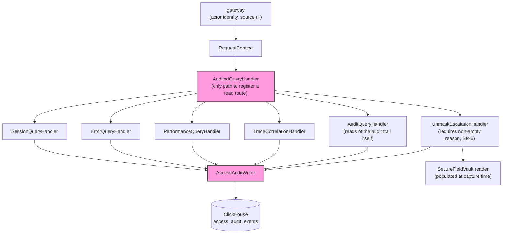
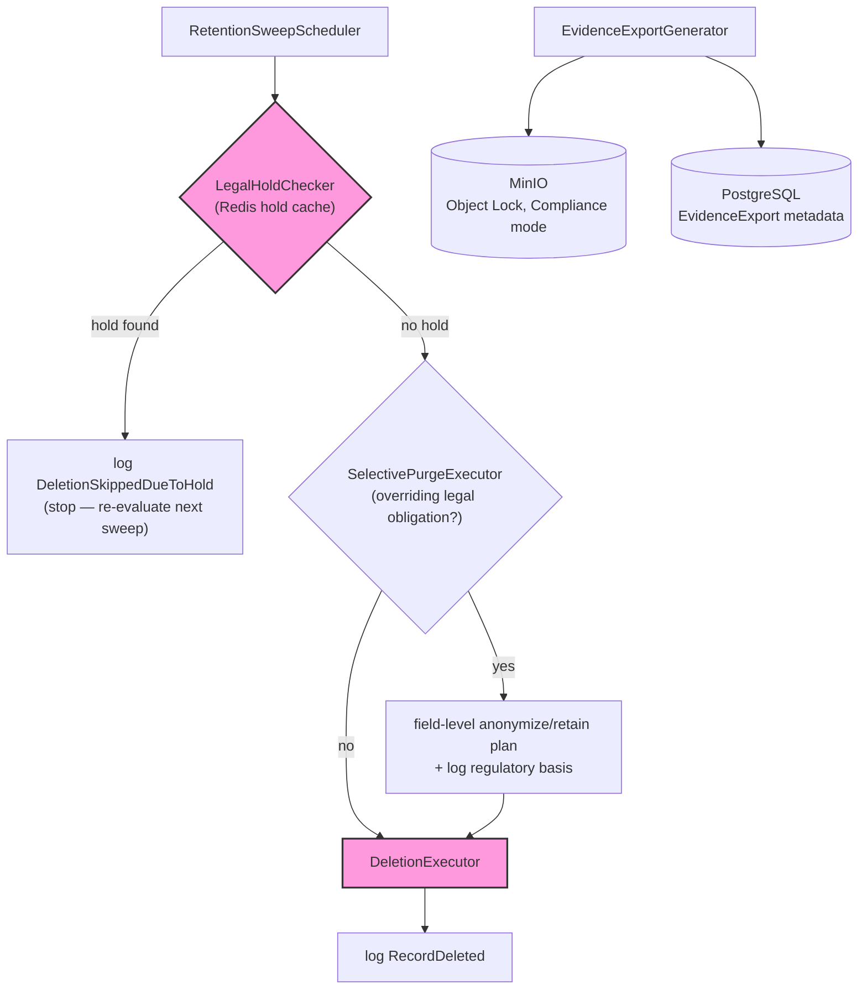

# Component Diagrams

> Status: Research-based, current as of July 2026. C4 model Level 3 — internal structure, but only for the two containers from [container-diagrams.md](container-diagrams.md) that carry actual business-rule enforcement weight: `query-api` and `workers`. The other six containers (browser-sdk, gateway, ingestion, alert-engine, notification-service, dashboard) are comparatively thin at this altitude and get their internal detail in their own `05-services/*.md` doc instead of here.

---

## query-api — Internal Components

### The structural problem this container has to solve

[bounded-contexts.md](../02-domain/bounded-contexts.md) established that AccessAuditEvent generation must belong exclusively to `query-api`, never `dashboard` — but stating that as a rule doesn't make it true. A convention that engineers must "remember" to call the audit logger from every new query handler is exactly the failure mode [business-rules.md](../02-domain/business-rules.md) BR-5 exists to prevent: a read that completes without an audit event is a defect, and defects happen precisely when correctness depends on someone remembering. The standard fix — and the one used in practice for exactly this problem (e.g., EF Core's interceptor pattern for automatic audit logging) — is to make the audit event **structurally inseparable from the read**, not procedurally attached to it.

### Components

Every query handler is an `AuditedQueryHandler` instance — there is no code path that reaches ClickHouse without first passing through `AccessAuditWriter`, which is the diagram's way of showing what the prose below states as a rule: this is structural, not procedural.

- **RequestContext** — receives the authenticated actor identity and source IP/device from `gateway` (per [system-context.md](system-context.md)'s actor model) and attaches it to every downstream call. No component below this line can execute without one.
- **AuditedQueryHandler** — not a convention, a **framework-level wrapper type that is the only way to register a read route at all.** A future engineer adding a new query endpoint cannot skip the audit step because there is no code path to register a handler that isn't wrapped in this type — the same principle as a build that fails when a required wiring seam is absent, applied to routing instead of compilation. `SessionQueryHandler`, `ErrorQueryHandler`, `PerformanceQueryHandler`, `TraceCorrelationHandler`, and `AuditQueryHandler` are each instances of `AuditedQueryHandler`, not handlers that separately remember to call an audit function.
- **AuditQueryHandler** — serves reads *of* the audit trail itself ([rest-api.md](../07-api/rest-api.md)'s `/v1/sessions/{id}/audit-trail`, and the access-history half of a DSAR query per [sequence-diagrams.md](sequence-diagrams.md) Flow B). Still wrapped in `AuditedQueryHandler` like every other read, but its own audit entry uses a lighter administrative action type rather than a recursive `SessionViewed` — querying the audit trail is a sensitive action worth recording, but must not regenerate its own infinite audit chain.
- **AccessAuditWriter** — the component `AuditedQueryHandler` invokes on every request, synchronously producing the SessionViewed/RecordExported AccessAuditEvent (per [event-catalog.md](../02-domain/event-catalog.md)) before or atomically with returning data — a read that fails to log is a read that fails, not a read that silently skips logging.
- **UnmaskEscalationHandler** — validates BR-6's non-empty reason field before permitting an UNMASK action, then routes through `AuditedQueryHandler` like every other read — unmask is not a special, differently-audited path, it's the same mechanism with an extra required field.
- **SecureFieldVault reader** — resolves the masked-value lookup for an approved unmask request (see the two-tier masking clarification below). Read-only from `query-api`'s side; the vault itself is populated at capture time, not by query-api.

### Two-Tier Masking — a Clarification This Document Has to Make Explicit

[domain-model.md](../02-domain/domain-model.md) Invariant 4 says a field with no allow-list rule is masked before it's ever written to storage. Story M2 says a masked PHI field can be escalated to unmasked with a logged justification. Taken literally, these are in tension: if an unrecognized field's real value is never captured at all, there's nothing left to unmask later. The resolution is that "masking" is actually two different mechanisms, not one:

1. **Hard redaction** — a field matching no known rule at all (the "new form field shipped without a matching selector" failure mode from [problem-statement.md](../00-overview/problem-statement.md)). The real value is never captured, never stored, anywhere, encrypted or not. This is irreversible by design — there is nothing to unmask.
2. **Soft masking with escalation** — a field matching a *known* PHI/PII pattern (name, MRN, diagnosis code, DOB — the examples from story M2). The real value **is** captured, but into the SecureFieldVault, encrypted at rest and access-gated, separate from the general SessionEvent payload. The default rendered view shows the masked placeholder; `UnmaskEscalationHandler` is the only path to the real value, and every use of that path is audited.

Only category 2 is unmaskable. This distinction belongs in this document specifically because it's a `query-api`/`browser-sdk` boundary decision — browser-sdk decides which category a field falls into at capture time, and `query-api` is where that decision's consequence (unmaskable or not) becomes visible.

---

## workers — Internal Components

### Components

`DeletionExecutor` has no incoming path that bypasses `LegalHoldChecker` — the diagram is the enforcement of [business-rules.md](../02-domain/business-rules.md)'s Conflict Precedence Summary, not just an illustration of it.

- **RetentionSweepScheduler** — triggers periodic RetentionPolicyEvaluated runs per data category, per BR-1.
- **LegalHoldChecker** — the check-before-destroy component implementing BR-2 exactly: queries the Redis active-hold cache (from [container-diagrams.md](container-diagrams.md)) immediately before any deletion, not at scheduling time. `DeletionExecutor` below is structurally incapable of running without first receiving a clear result from this component — the same "make the correct order the only possible order" principle applied to `query-api`'s audit wrapper above, applied here to [business-rules.md](../02-domain/business-rules.md)'s Conflict Precedence Summary (hold check first, always).
- **SelectivePurgeExecutor** — implements BR-3's resolution for GDPR-erasure-vs-legal-obligation conflicts: given an erasure request and a set of overriding obligations, produces the specific field-level anonymize/retain plan and the regulatory basis to log, rather than a binary delete-everything/delete-nothing decision.
- **EvidenceExportGenerator** — implements BR-4: freezes the referenced Session/ErrorEvent/SecurityEvent/AccessAuditEvent records into a single object-storage blob, computes `contentHash`, and writes the Postgres metadata row — the component that makes an EvidenceExport genuinely immune to later retention or erasure actions, per [domain-model.md](../02-domain/domain-model.md)'s resolved open question.
- **DeletionExecutor** — the only component permitted to issue an actual delete against ClickHouse or Postgres, and only ever invoked downstream of a clear `LegalHoldChecker` result.

### Interaction Order (the sequence BR-2/BR-3's precedence rule requires)

`RetentionSweepScheduler` → `LegalHoldChecker` (hold? → log DeletionSkippedDueToHold, stop) → `SelectivePurgeExecutor` (overriding legal obligation? → field-level plan, log basis) → `DeletionExecutor` (only reachable if both prior checks clear). This ordering is not incidental — it's [business-rules.md](../02-domain/business-rules.md)'s Conflict Precedence Summary made structural: a `workers` implementation where `DeletionExecutor` could be reached without passing through `LegalHoldChecker` first would reintroduce the exact race condition BR-2 exists to prevent.

---

## What's Deliberately Not Modeled Here

- Internal structure of `browser-sdk`, `gateway`, `ingestion`, `alert-engine`, `notification-service`, `dashboard` — each gets this level of detail in its own `docs/05-services/*.md` if warranted, not here.
- Actual code/class names, language choice, or framework selection — that's an implementation decision downstream of this document, not a C4-level concern.
- The SecureFieldVault's encryption scheme — that's `08-security/encryption.md`.

---

Sources: [Comprehensive Guide to Implementing Audit Logging in .NET with EF Core Interceptors](https://dev.to/hootanht/comprehensive-guide-to-implementing-audit-logging-in-net-with-ef-core-interceptors-1e83).

## What This Feeds Next

`docs/04-architecture/sequence-diagrams.md` should trace at least two flows through these components step-by-step: a DSAR query (story A1, through `query-api`'s AuditedQueryHandler) and a retention sweep hitting an active hold (through `workers`' interaction order above). `docs/08-security/pii-redaction.md` should specify the SecureFieldVault mechanism the two-tier masking clarification depends on.
