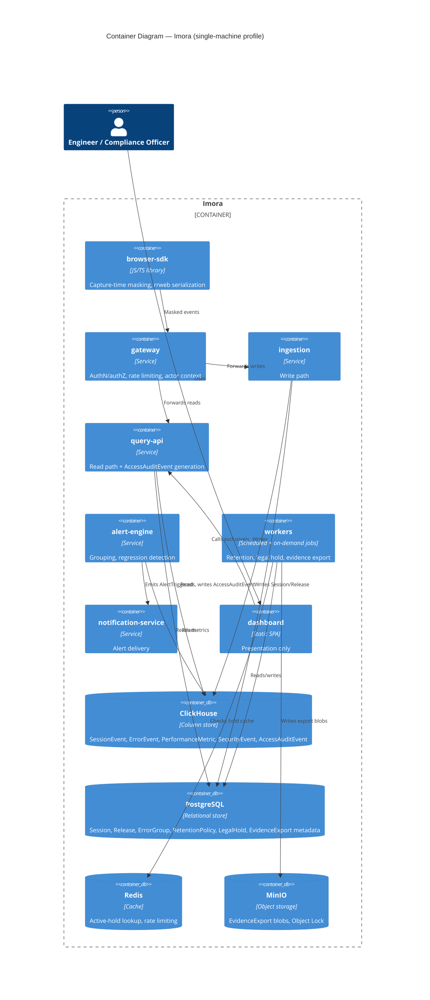

# Container Diagrams

> Status: Research-based, current as of July 2026. C4 model Level 2 — expands the single "Imora" box from [system-context.md](system-context.md) into deployable containers: the eight bounded contexts from [bounded-contexts.md](../02-domain/bounded-contexts.md), plus the data stores they depend on. Technology choices below aren't invented — they follow the storage split already implied by the `06-data/` scaffold (`clickhouse-schema.md`, `postgres-schema.md`) and real comparator architecture.

---

## Diagram — Single-Machine Profile

No message queue in this profile — `ingestion` writes directly to ClickHouse, per the single-machine simplification below.

---

## Data Stores

The write/read separation and column-store choice from [bounded-contexts.md](../02-domain/bounded-contexts.md)'s modeling approach implies a specific storage split, matching the pattern of the closest architectural comparator (Uptrace, an open-source APM/observability platform whose entire self-hosted footprint is one binary plus ClickHouse, PostgreSQL, and Redis — deliberately no Kafka at small scale):

| Store | Holds | Why this store |
|---|---|---|
| **ClickHouse** | SessionEvent, ErrorEvent, PerformanceMetric, SecurityEvent, AccessAuditEvent | All five are high-volume, append-only, time-series-shaped — exactly the write pattern ClickHouse is built for, and the pattern [bounded-contexts.md](../02-domain/bounded-contexts.md) already assumed for the write/read split. |
| **PostgreSQL** | Session (summary row), Release, ErrorGroup, RetentionPolicy, LegalHold, EvidenceExport (metadata + pointer), user/RBAC config | Small-cardinality, relational, transactionally updated data — a LegalHold being applied or lifted, or an ErrorGroup being assigned, needs ACID guarantees ClickHouse doesn't provide. |
| **Object Storage** (S3-compatible; MinIO for self-hosted deployments with no cloud dependency) | EvidenceExport frozen blob artifacts | Per [business-rules.md](../02-domain/business-rules.md) BR-4, an EvidenceExport is a self-contained frozen copy — that copy is a blob, not a set of database rows, so it belongs in object storage with its `contentHash` recorded in Postgres. |
| **Redis** (small, optional even at scale) | Active-LegalHold lookup cache, gateway rate-limiting | [business-rules.md](../02-domain/business-rules.md) BR-2 requires a hold check immediately before every deletion executes — running that as a full Postgres query per candidate record at scale is wasteful; a cache of currently-active holds, invalidated on LegalHoldApplied/LegalHoldLifted, keeps the check-before-destroy step fast without weakening it. |

---

## The Eight Containers

| Container | Technology shape | Responsibility (from [bounded-contexts.md](../02-domain/bounded-contexts.md)) | Reads/Writes |
|---|---|---|---|
| **browser-sdk** | Client-side JS/TS library, not a server | Capture-time masking, rrweb-style event serialization | Sends to `gateway` |
| **gateway** | Stateless API/reverse-proxy service | AuthN/authZ, field-level access control, actor-context stamping | Reads Redis (rate limits), forwards to `ingestion`/`query-api` |
| **ingestion** | Stateless write-path service | Accepts and persists SessionEvent/ErrorEvent/PerformanceMetric/SecurityEvent/TraceLink | Writes ClickHouse; writes Session/Release rows to Postgres |
| **query-api** | Stateless read-path service | Serves replay/error/metric queries; **generates AccessAuditEvent on every VIEW/EXPORT/UNMASK** | Reads ClickHouse + Postgres + object storage; writes AccessAuditEvent to ClickHouse |
| **alert-engine** | Stream or scheduled batch processor | ErrorGroup grouping (write-time), Core Web Vitals regression detection | Reads/writes Postgres (ErrorGroup) and ClickHouse (metrics); emits AlertTriggered |
| **workers** | Scheduled/background job runner | RetentionPolicy sweeps (BR-1), legal-hold check-before-destroy (BR-2), selective purging (BR-3), EvidenceExport generation (BR-4) | Reads Redis (hold cache) + Postgres + ClickHouse; writes object storage (exports), AccessAuditEvent |
| **notification-service** | Stateless delivery service | Translates AlertTriggered into email/Slack/webhook delivery | Consumes from `alert-engine`; calls external channels (optional, per [system-context.md](system-context.md)) |
| **dashboard** | Static SPA | Presentation only — zero domain entities, zero audit-log authority, per [bounded-contexts.md](../02-domain/bounded-contexts.md) | Calls `query-api` exclusively |

---

## Two Topology Profiles, Not One

Per [system-context.md](system-context.md)'s Operational Simplicity finding, and per Priya's story P1 (a 2–3 person team must be able to deploy a working single-machine instance), a full distributed topology — eight independently-scaled services plus ClickHouse, Postgres, object storage, and a message queue — is not a viable default. Uptrace and OpenObserve both resolve this the same way: **collapse the topology for small scale, expand it for large scale, without changing the domain model underneath.**

### Single-Machine Profile (Milestone 1, story P1)

- All eight containers run as processes on one host (Docker Compose or equivalent), not eight separately-scaled deployments.
- **No message queue.** `ingestion` writes directly to ClickHouse; `alert-engine` and `workers` poll or subscribe directly rather than consuming from Kafka. This is the same simplification Uptrace makes at small scale — a queue exists to smooth backpressure and enable replay under load neither of which is a real constraint on a single machine.
- ClickHouse, Postgres, Redis, and object storage (MinIO) run as sibling containers on the same host.
- This profile must still pass every Milestone 1 exit criterion from [feature-roadmap.md](../01-product/feature-roadmap.md) — audit-trail correctness and legal-hold enforcement are not weakened at small scale, only the deployment topology is simplified.

### Cluster Profile (Milestone 3, large-enterprise scale)

- Containers scale independently; `ingestion` and `query-api` in particular, since they have different load shapes (write-heavy vs. read-latency-sensitive) per the write/read separation rationale.
- **A message queue (Kafka or equivalent) is introduced** between `ingestion` and its consumers (`alert-engine`, `workers`) specifically to buffer write bursts and allow reprocessing — the durability property a single-machine deployment doesn't need but a 300+-employee enterprise's transaction-volume does, per the org-size variants in [target-users.md](../00-overview/target-users.md).
- ClickHouse and Postgres move to managed clusters (or multi-node self-managed) with the multi-region/HA orchestration tooling from [feature-roadmap.md](../01-product/feature-roadmap.md) Milestone 3.

**The domain model, business rules, and event catalog from `02-domain/` do not change between profiles.** Only the physical deployment shape does — a query-api instance behaves identically whether it's one of one or one of twenty, per [bounded-contexts.md](../02-domain/bounded-contexts.md)'s context boundaries.

---

## Data Flow, Narrated

- **Capture:** Data Subject browses → browser-sdk masks at capture time (BR-7) → gateway authenticates the ingesting client → ingestion writes SessionEvent/ErrorEvent/PerformanceMetric to ClickHouse, Session/Release rows to Postgres.
- **Investigation:** Engineer opens dashboard → query-api serves the replay/error/metric query from ClickHouse+Postgres → **query-api writes a SessionViewed AccessAuditEvent to ClickHouse as an inseparable part of that read**, per [bounded-contexts.md](../02-domain/bounded-contexts.md)'s ownership rule.
- **Retention sweep:** workers evaluates RetentionPolicy on a schedule → checks Redis's active-hold cache (BR-2) → deletes (writes RecordDeleted) or skips (writes DeletionSkippedDueToHold) → both land in ClickHouse's AccessAuditEvent stream.
- **Evidence export:** Compliance Officer requests an export → workers freezes the referenced records into an object-storage blob (BR-4) → records the `contentHash` and metadata in Postgres → writes RecordExported to the audit log.

---

## Air-Gapped Constraint, Carried Forward

Per [system-context.md](system-context.md), none of the containers above may depend on an external system to perform a Parity or Wedge function. Concretely: ClickHouse, PostgreSQL, Redis, and object storage are all self-hosted components within the deployment boundary in both topology profiles — none of them are a cloud-managed dependency by default, which is what makes the air-gapped variant possible without a second, parallel architecture.

---

## What's Deliberately Not Modeled Here

- Internal structure of any single container (e.g., how `query-api` is organized internally) — that's `component-diagrams.md`, next.
- Kubernetes manifests, actual node counts, or specific cloud/on-prem infrastructure choices — that's `deployment-model.md`.
- Concrete scaling thresholds (at what load does Milestone 1's single-machine profile stop being viable) — that's `scaling.md`.

---

Sources: [Self-hosting Uptrace](https://uptrace.dev/get/hosted), [What is observability in 2026? — ClickHouse](https://clickhouse.com/resources/engineering/what-is-observability), [ClickStack — ClickHouse](https://clickhouse.com/clickstack).

## What This Feeds Next

`docs/04-architecture/component-diagrams.md` should expand `query-api` and `workers` specifically — the two containers carrying the most business-rule weight (audit-event generation, BR-1 through BR-4) — into their internal component structure. `docs/06-data/clickhouse-schema.md` and `postgres-schema.md` can now be written directly against the store assignments in this document.
