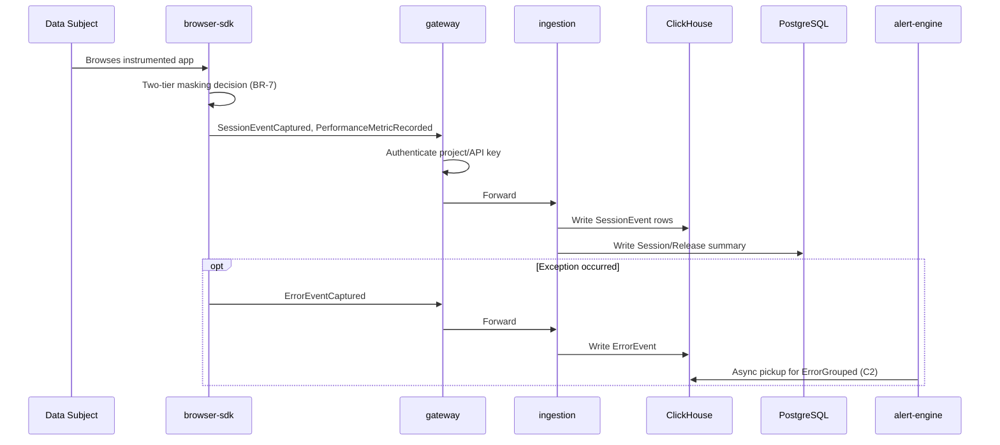
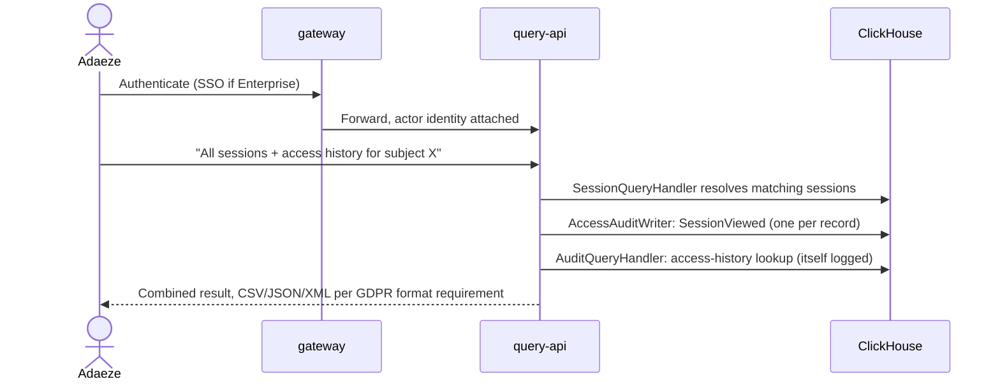
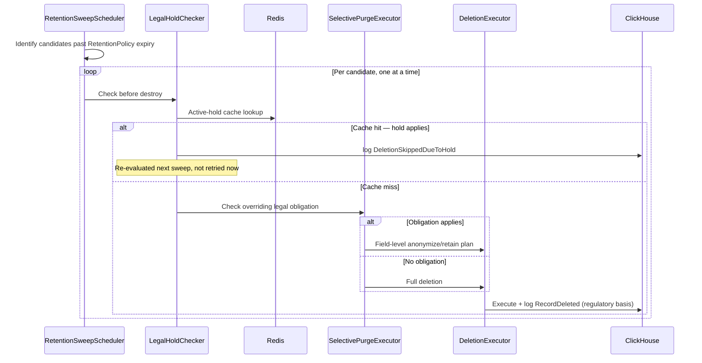
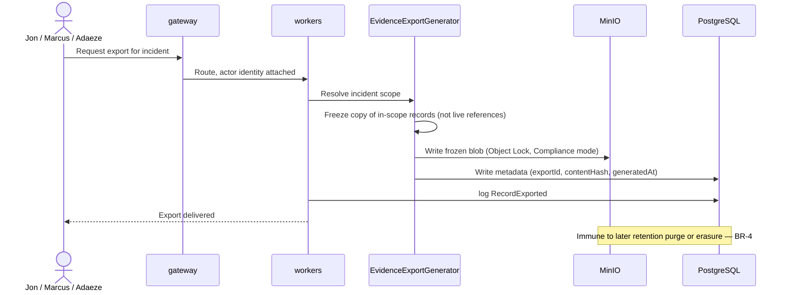

# Sequence Diagrams

> Status: Traces four flows step-by-step through the components defined in [container-diagrams.md](container-diagrams.md) and [component-diagrams.md](component-diagrams.md), applying the business rules from [business-rules.md](../02-domain/business-rules.md) concretely rather than restating them abstractly. Each flow is rendered as a Mermaid sequence diagram, with the numbered prose immediately below it as the citation-bearing detail the diagram can't carry — read the diagram for shape, the prose for why.

---

## Flow A — Session Capture (Parity)

The foundational flow; every other sequence below depends on data having entered the system this way.

1. Data Subject browses the organization's instrumented web application.
2. `browser-sdk` observes DOM state via the rrweb-style capture pattern (full snapshot + incremental mutations, per [domain-model.md](../02-domain/domain-model.md)).
3. For each field, `browser-sdk` applies the two-tier masking decision from [component-diagrams.md](component-diagrams.md): known-safe fields captured as-is; known-PHI/PII fields captured into the SecureFieldVault with a masked placeholder in the event payload; unrecognized fields hard-redacted (BR-7) — never captured at all.
4. `browser-sdk` emits `SessionEventCaptured` and `PerformanceMetricRecorded` events to `gateway`.
5. `gateway` authenticates the ingesting client (project/API key) and forwards to `ingestion`.
6. `ingestion` writes SessionEvent rows to ClickHouse, a Session summary row to Postgres, tagged with the active Release.
7. If an exception occurred: `ErrorEventCaptured` follows the same path; `alert-engine` picks it up asynchronously for `ErrorGrouped` write-time grouping (story C2).

---

## Flow B — DSAR Query (Wedge, Story A1)

Adaeze's one-month clock from [user-personas.md](../01-product/user-personas.md) starts the moment this flow needs to run.

1. Adaeze authenticates via `gateway` (SSO if Enterprise tier, per [system-context.md](system-context.md)).
2. `gateway` attaches actor identity (userId, source IP) to the request context, forwards to `query-api`.
3. Adaeze issues a query — "all sessions and access history for data subject X" — via `dashboard`, which calls `query-api` directly with no translation of its own (per [bounded-contexts.md](../02-domain/bounded-contexts.md)'s Conformist relationship).
4. `query-api`'s `SessionQueryHandler` (an `AuditedQueryHandler` instance, per [component-diagrams.md](component-diagrams.md)) resolves matching Sessions from ClickHouse/Postgres.
5. **Before or atomically with returning results**, `AccessAuditWriter` writes one `SessionViewed` AccessAuditEvent per session record touched — granular enough to answer "who viewed *this specific* session," not an aggregate "DSAR query ran" log line.
6. `query-api` separately queries AccessAuditEvent history for those sessions via `AuditQueryHandler` to answer "who has looked at this." **This read is itself logged**, using a lighter administrative action type rather than a recursive `SessionViewed` entry — querying the audit trail is still a sensitive action worth recording, but doesn't need to regenerate its own infinite audit chain.
7. `query-api` returns the combined result (session records + access history) in a non-proprietary format (CSV/JSON/XML, per story A1's acceptance criteria) — Adaeze's answer, typically in minutes rather than the multi-hour manual log search this flow replaces.

---

## Flow C — Retention Sweep Hitting an Active Legal Hold (Wedge, BR-1/BR-2)

1. `RetentionSweepScheduler` triggers on schedule for a given data category (its own clock, per BR-1).
2. The scheduler identifies candidate records past their RetentionPolicy expiry.
3. For each candidate — one at a time, not as a pre-checked batch — `LegalHoldChecker` queries the Redis active-hold cache, kept current by invalidation on every `LegalHoldApplied`/`LegalHoldLifted` event.
4. **Cache hit** (the record's scope matches an active hold): deletion is skipped; `workers` writes `DeletionSkippedDueToHold`; the record is re-evaluated on the next scheduled sweep, not retried immediately.
5. **Cache miss:** `SelectivePurgeExecutor` checks whether an overriding legal obligation applies independent of any explicit hold (BR-3's non-hold case — e.g., a HIPAA floor still active with no LegalHold entity involved). If yes, it computes a field-level anonymize/retain plan; if no, the record proceeds to full deletion.
6. `DeletionExecutor` executes — full or selective — and writes `RecordDeleted` with the specific regulatory basis that triggered it.
7. **The race condition BR-2 exists to prevent, resolved concretely:** because the hold check happens immediately before *each individual record's* deletion rather than once for the whole sweep batch, a hold applied mid-sweep is caught for every record not yet processed. Records already deleted earlier in the same sweep, before the hold existed, were deleted legitimately under policy — the hold's absence at that moment is the correct historical fact, not a bug to reconcile after the fact.

---

## Flow D — Evidence Export Generation (Wedge, Story J2/BR-4)

1. Jon, Marcus, or Adaeze requests an evidence export for a specific incident, via `dashboard` → `gateway`.
2. `gateway` attaches actor identity, routes to `workers` (export generation is a `workers` responsibility, not `query-api`'s, per [container-diagrams.md](container-diagrams.md)).
3. `EvidenceExportGenerator` resolves the incident's scope — which Sessions, ErrorEvents, SecurityEvents, and AccessAuditEvents are in-play.
4. `EvidenceExportGenerator` freezes a copy of every in-scope record into a single object-storage blob (MinIO) — a copy, not a set of live references, per [domain-model.md](../02-domain/domain-model.md)'s resolved open question.
5. `EvidenceExportGenerator` computes `contentHash` over the frozen blob and writes the EvidenceExport metadata row (exportId, incidentReference, contentHash, generatedAt) to Postgres.
6. `workers` writes `RecordExported` to the audit log.
7. The requesting actor receives the export. Per BR-4, this artifact remains valid regardless of what happens to the source data afterward — a later retention sweep (Flow C) or erasure request cannot touch it, because it was never a live reference to begin with.

---

## What These Four Flows Establish Together

Flow A is the only one that doesn't touch AccessAuditEvent — everything downstream of ingestion (B, C, D) produces one, which is the concrete, traceable version of [bounded-contexts.md](../02-domain/bounded-contexts.md)'s claim that the wedge isn't a bolt-on: from the moment data exists in the system, every subsequent read, deletion, skip, or export is accounted for by construction, not by a policy document describing what's supposed to happen.

## What This Feeds Next

`docs/04-architecture/deployment-model.md` should specify where each component in these flows actually runs (single-machine vs. cluster profile, per [container-diagrams.md](container-diagrams.md)). `docs/07-api/rest-api.md` and `docs/07-api/sdk-api.md` can be written directly against Flow A and Flow B's request/response shapes.
