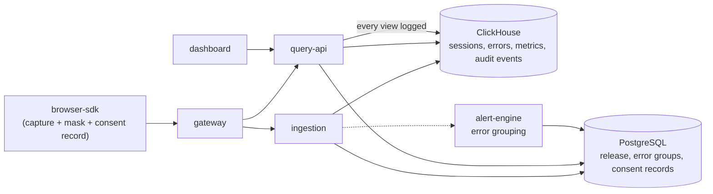

# Design Doc: Imora

> Status: Draft, single source of truth for what's actually decided. One document, meant to be read start to finish in about 20 minutes — not a folder to navigate. Detail beyond what's here belongs in an ADR (`adr/`) if it's a real, hard-to-reverse decision, or gets figured out during implementation, not specified in advance.

---

## Problem

Regulated organizations (banks, insurers, hospitals, government agencies) can't get deep frontend observability without either sending customer session data to a third party or giving up most of the visibility that third party would provide.

The cost of that trade-off is concrete, not theoretical:
- **Healthcare data breaches average $7.42M** — the highest of any industry, 15 years running (IBM Cost of a Data Breach Report 2025).
- **A wave of active lawsuits** (California's CIPA wiretapping statute) targets companies specifically for running third-party session-replay scripts without provable consent — a healthcare provider paid $21.5M in one such settlement in April 2026. This exposure exists independent of any breach.
- **Tool fragmentation has a measured cost**: teams running 4–8 separate observability tools report $100K–$400K/year in tooling spend, plus a 20–40% incident-resolution-time tax from manually correlating data across them.

Existing options each solve part of this and not the rest: SaaS incumbents (Sentry, Datadog, LogRocket, FullStory) have deep observability but the data leaves the organization's infrastructure. Self-hosted alternatives (OpenReplay, PostHog) solve data locality but ship no audit trail, no consent record, and no regulatory-clock retention.

## Positioning

Imora is **an alternative to Sentry, Datadog RUM, LogRocket, and FullStory** — not a new category. It has to clear the same bar those tools (and the closest self-hosted alternatives) already set for ordinary debugging, and it wins the deal on the specific things none of them do.

- **Parity**: what it takes to be a credible alternative at all — error tracking, session replay, performance monitoring, matching what engineers already expect.
- **Wedge**: the reason to pick it over any alternative — an access-audit-trail over who viewed a customer's session, a consent record proving what basis existed when a session was captured, and (post-MVP) retention mapped to actual regulatory clocks and one-click evidence export.

A product that's only compliant and mediocre at debugging won't get adopted daily. A product that's a great debugger with no compliance story doesn't solve the problem regulated buyers actually have. Both have to be real from the first release.

## Who It's For

| Role | What they need |
|---|---|
| CISO / Security lead | Proof that customer session data never left the organization's infrastructure — removes the fact pattern the CIPA lawsuits above are winning on. |
| Compliance officer (DPO / HIPAA Security Officer) | An access-audit-trail and consent record they can hand a regulator directly, without reconstructing it by hand. |
| Platform / infrastructure lead | A single-machine deployment a 2–3 person team can actually run, not a distributed system requiring a dedicated platform team. |
| Engineer (day-to-day user) | A debugging experience — error grouping, session replay, performance regression detection — that's at least as good as what they're replacing. This is the adoption check: if this persona doesn't want to open the product daily, the compliance pitch alone won't save it. |

---

## MVP — The Smallest Thing That Goes Live

Everything below is required for a first release. Nothing here is optional or deferred:

- **Error tracking** with grouping by root cause (one alert per underlying bug, not one per affected user).
- **Session replay** (one framework's SDK to start — the framework-agnostic core/wrapper split can wait for a second framework, but the core capture engine is built framework-agnostic from day one so that split is cheap later).
- **Performance monitoring** against Core Web Vitals (LCP, INP, CLS), with regressions attributed to the release that caused them.
- **Capture-time PII masking, fail-closed by default** — a field with no explicit safe/sensitive classification is never captured at all, not captured-and-hoped. Non-negotiable even at MVP: this is what makes the product usable for a hospital on day one.
- **Access-audit-trail** — every view of a session or masked field is logged: who, when, why (for unmasking). This is the one Wedge capability in v0; everything else about "prove compliance" depends on this existing first.
- **Consent record** — a timestamped entry attached to each session recording what consent basis applied when it started. Closes a real gap: self-hosting removes the "sent to a third party" problem, not the "can you prove the user agreed" problem, and both drive the same lawsuits.
- **Environment tagging** (development / staging / production) on every captured event — the same mechanism as release tagging, so test noise never mixes with real production issues, and so non-production data can later carry lighter compliance rules once that policy is decided.
- **Single-machine deployment only** (Docker Compose). No cluster profile, no Kubernetes, no high availability — those are solved problems to defer, not unknowns to design around prematurely.

### MVP Architecture, Briefly

Six pieces, two data stores. No message queue, no Redis, no object storage, no background job runner — those exist to support Beyond MVP features (legal hold, evidence export, retention automation) and would be premature infrastructure for a product that hasn't shipped yet.

---

## Beyond MVP

Real, planned, deliberately not in v0:

- Retention-policy automation mapped to regulatory clocks (currently: no automatic deletion — data simply doesn't expire until this ships).
- Legal hold (override deletion for records under investigation).
- One-click evidence export for auditors/regulators.
- Data-subject erasure request handling.
- Additional framework SDK wrappers beyond the first.
- Cluster/Kubernetes deployment profile, for scale.
- SSO/SAML enterprise login.
- Outbound webhooks.
- Replay-to-backend-trace correlation.

None of these block a first release. All of them matter for a large regulated customer eventually — they get built once the MVP has proven engineers actually want to use the product daily.

---

## Key Trade-offs

- **AGPLv3 for the whole product, no paid feature-gating** — see `adr/0001`. The alternative (gate the audit trail behind a paid tier, as PostHog does) would replicate the exact "pay us for compliance" dependency self-hosting is supposed to remove.
- **ClickHouse for high-volume append-only data, PostgreSQL for small-cardinality relational data** — see `adr/0002`. One store for both would be a poor fit for at least one of the two shapes.
- **Monorepo, single root license, no `ee/`-style directory** — see `adr/0003`.
- **Single-machine and cluster as two explicit profiles, not one topology that tries to fit both** — see `adr/0004`. MVP only builds the first.
- **The audit trail is enforced structurally (a wrapper type that's the only way to register a read route), not by convention** — see `adr/0009`. This is the single decision that makes the compliance pitch a guarantee instead of a policy statement.
- **Masking is two mechanisms (hard redaction vs. vault-backed soft masking with audited escalation), decided at capture time** — see `adr/0006`.

## Open Questions

- Should non-production environments (dev/staging) get automatically lighter compliance rules once retention automation ships, or does a customer have to configure that explicitly? Unresolved — flagged in the MVP scope above, not blocking v0 since there's no automatic deletion yet either way.
- Exact consent-record schema (what "basis" and "method" values it supports) — needs one real example (a cookie-banner integration) before generalizing further.
- Whether a second framework SDK wrapper ships alongside MVP or immediately after — depends on which framework the first design partner actually uses.
