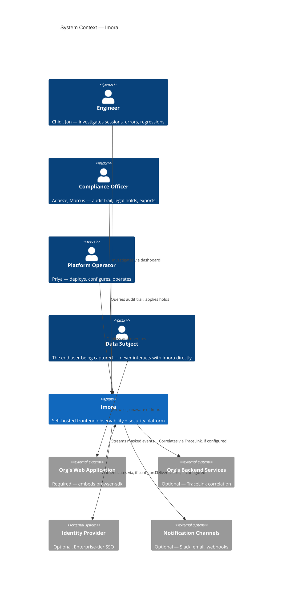

# Architecture

## Architecture Overview

> Status: Synthesizes [System Context](README.md#system-context) through [Scaling](README.md#scaling) into the single narrative entry point this folder otherwise lacks. Read this first; go to the individual documents for the detail behind any claim here.

---

### The Shape of the Architecture, in One Paragraph

Imora is one system ([System Context](README.md#system-context)) built from eight bounded contexts ([Bounded Contexts](../02-domain/README.md#bounded-contexts), made concrete in [Container Diagrams](diagrams.md#container-diagrams)) split cleanly along a write path (`browser-sdk` → `gateway` → `ingestion`) and a read path (`query-api` → `dashboard`), with a background context (`workers`) that owns the compliance-critical jobs — retention sweeps, legal-hold enforcement, evidence export — that shouldn't run inline with a user-facing request. Two of those eight containers, `query-api` and `workers`, carry almost all the actual business-rule weight and get their internal structure specified in [Component Diagrams](diagrams.md#component-diagrams); the other six are comparatively thin at that altitude. The whole system deploys in one of two topology profiles ([Deployment Model](README.md#deployment-model)) — a single Docker Compose host or a Kubernetes cluster — with air-gapping as an orthogonal setting on either profile, not a third variant.

---

### The Core Architectural Bet

Per [Vision](../00-overview/README.md#vision), Imora's entire pitch rests on the wedge (access-audit-trail, regulatory-clock retention, evidence export) being real guarantees, not documented intentions. Every document in `03-architecture/` exists to make that bet structurally true rather than procedurally true:

- **AccessAuditEvent generation is architecturally impossible to skip**, not a convention — `query-api`'s `AuditedQueryHandler` is the only way to register a read route at all ([Component Diagrams](diagrams.md#component-diagrams)).
- **The legal-hold check runs immediately before every individual deletion**, not once per batch — closing the exact race condition a less careful implementation would reintroduce ([Sequence Diagrams](diagrams.md#sequence-diagrams) Flow C).
- **An EvidenceExport is a frozen copy at generation time**, immune by construction to anything that happens to its source data afterward ([Sequence Diagrams](diagrams.md#sequence-diagrams) Flow D).
- **Backup RPO for AccessAuditEvent is a compliance requirement, not an ops nicety** — a lost audit record is indistinguishable from a HIPAA §164.312(b) failure to an assessor ([Deployment Model](README.md#deployment-model)).

None of these were achievable by writing "must be audited" in a requirements document — each required a specific structural decision at the architecture layer, which is the actual justification for this folder existing as more than a formality.

---

### The Five Findings Worth Remembering

If nothing else from this folder is read, these five are the load-bearing ones:

1. **Two system-context variants, not one** — air-gapped deployments must clear every Parity and Wedge bar with zero external systems present; SSO, notifications, and backend correlation are all optional convenience, never load-bearing ([System Context](README.md#system-context)).
2. **The audit-log guarantee had to be made structural** — a wrapper type that's the only registration path for a read route, not a function callers remember to invoke ([Component Diagrams](diagrams.md#component-diagrams)).
3. **Masking is two mechanisms, not one** — hard redaction (unrecognized fields, never captured, never unmaskable) and soft masking with audited escalation (known PHI/PII fields, captured into a vault) — resolving an apparent contradiction between [Domain Model](../02-domain/README.md#domain-model)'s capture-time invariant and story M2's unmask requirement.
4. **Air-gapped updates reuse the license-activation pattern** — the same signed-bundle-via-removable-media process from [Pricing](../01-product/README.md#pricing) solves software updates too, not a second procedure ([Deployment Model](README.md#deployment-model)).
5. **The scaling trigger is retention-driven storage, not throughput** — a genuinely counter-intuitive result for an observability product, and specific to Imora's multi-year regulatory retention obligations that no SaaS-only competitor has to plan around ([Scaling](README.md#scaling)).

---

### Reading Order for Someone New to This Folder

1. This document, for orientation.
2. [System Context](README.md#system-context) — who and what touches Imora from outside.
3. [Container Diagrams](diagrams.md#container-diagrams) — the eight services and their data stores.
4. [Component Diagrams](diagrams.md#component-diagrams) — inside `query-api` and `workers` specifically.
5. [Sequence Diagrams](diagrams.md#sequence-diagrams) — four flows traced through all of the above.
6. [Deployment Model](README.md#deployment-model) and [Scaling](README.md#scaling) — where it runs, and when that stops being enough.

Everything here assumes [Domain Model](../02-domain/README.md#domain-model), [Bounded Contexts](../02-domain/README.md#bounded-contexts), [Business Rules](../02-domain/README.md#business-rules), and [Event Catalog](../02-domain/README.md#event-catalog) from `02-domain/` as settled — this folder is what those become once they have to run somewhere.

---

### What's Not Yet Covered

This folder specifies structure and behavior; it deliberately stops short of:

- Actual field-level schemas — `05-data/`.
- Wire protocols and public API shape — `06-api/`.
- The SecureFieldVault's encryption mechanism and other security implementation detail — `07-security/`.
- Actual Compose/Kubernetes manifests and CI/CD — `12-infrastructure/`.
- How the eight bounded contexts map to actual code organization (monorepo vs. polyrepo, folder layout) — [Repository Structure](README.md#repository-structure), now written; monorepo with a single root license, per ADR [0003](../11-engineering/architecture-decisions/0003-monorepo-structure.md).

---

### What This Feeds Next

`research/03-architecture/README.md#repository-structure` closes out this folder — the last translation step, from bounded contexts to an actual codebase layout. After that, `05-data/` and `07-security/` are the two folders this document leans on most heavily (the SecureFieldVault and the ClickHouse/Postgres schemas), and are the natural next tier.

---

## System Context

> Status: Research-based, current as of July 2026. C4 model Level 1 — the highest, most abstract view: Imora as a single box, its people, and the external systems it touches. Per C4 convention this is deliberately non-technical (no protocols, no service names — those are [Bounded Contexts](../02-domain/README.md#bounded-contexts) and `diagrams.md#container-diagrams`'s job) and limited to the 2–4 actors and 2–4 external systems that actually matter, not an exhaustive list.

---

### The System

**Imora** — one box. Everything inside it (the eight bounded contexts, the domain entities) is out of scope for this document by design; a system context diagram that shows internal detail has stopped being a system context diagram.



The three optional external systems are drawn the same way regardless of whether a given deployment is connected or air-gapped — per the finding below, their presence is a configuration choice, not a structural one.

---

### People

Per C4 convention, actors are the human roles that directly interact with the system — which produces one modeling decision worth stating explicitly:

| Actor | Interacts via | What they do |
|---|---|---|
| **Engineer** (Chidi, Jon) | dashboard | Investigates sessions, errors, performance regressions, and correlated incidents. |
| **Compliance Officer** (Adaeze, Marcus) | dashboard, query-api | Queries the access-audit-trail, applies/lifts legal holds, generates evidence exports, resolves DSAR/erasure requests per [Business Rules](../02-domain/README.md#business-rules). |
| **Platform Operator** (Priya) | deployment tooling, admin surface | Deploys, configures, and operates the self-hosted instance — the actor evaluating everything in `README.md#deployment-model` and `README.md#scaling`. |
| **Data Subject** (the end user whose browsing is captured) | *does not interact with Imora directly* | Uses the regulated organization's own web application, which happens to be instrumented. This person has typically never heard of Imora. Modeling them as a normal actor with an arrow "into" the system would be a mistake — the only path by which they affect the system is indirectly, through a DSAR the Compliance Officer resolves on their behalf. This distinction is precisely why Adaeze's role exists at all. |

Four actors, not five, per the 2–4 guidance — Dara (CISO) is deliberately not a separate row here: her interaction with the system (reviewing evidence exports, board-level reporting) is a subset of the Compliance Officer's queries, not a distinct usage pattern at this level of abstraction.

---

### External Systems

| System | Required or optional | Relationship |
|---|---|---|
| **The organization's own web/mobile application** | Required | Embeds browser-sdk. This is the source of every SessionEvent, ErrorEvent, and PerformanceMetric — there is no Imora deployment without one of these. |
| **The organization's backend services** | Optional | Correlated via TraceLink (story J1) when instrumented with a compatible session/trace identifier. Per [Product Requirements Document (PRD)](../01-product/README.md#product-requirements-document-prd)'s Non-Goals, Imora does not own or replace backend tracing — it only consumes a correlation ID from a system it doesn't manage. |
| **Identity Provider (SSO/SAML)** | Optional, Enterprise-tier | Per [Pricing](../01-product/README.md#pricing) and [Licensing](../01-product/README.md#licensing), enterprise auth integration is a legitimate commercial add-on — never required to use the core (parity + wedge) product. |
| **Notification channels (email, Slack, webhook endpoints)** | Optional | notification-service delivers AlertTriggered outcomes here, per [Event Catalog](../02-domain/README.md#event-catalog). |

---

### The Finding This Document Exists to Surface: Two Context Variants, Not One

A standard system context diagram assumes one topology. Imora can't — [Vision](../00-overview/README.md#vision)'s Operational Simplicity principle explicitly commits to "fully air-gapped environments with no outbound dependency for core function," which means the *set of external systems present* is itself a deployment-mode decision, not a constant:

- **Connected deployment:** all four external systems above may be present. SSO simplifies Platform Operator/Engineer login; notifications reach Slack/email; backend TraceLink correlation is live.
- **Air-gapped deployment:** only the organization's own web application is present. No SSO, no outbound notifications, no external backend correlation (TraceLink correlation is simply inactive if nothing is configured to receive it) — **and every Parity and Wedge capability must still work at full strength.** An access-audit-trail that degrades, or a legal-hold check that silently no-ops, because an air-gapped instance can't reach an external system would directly contradict Dara's and Adaeze's core requirement in [User Personas](../01-product/README.md#user-personas).

The practical consequence for every document downstream of this one: nothing in `diagrams.md#container-diagrams`, `diagrams.md#component-diagrams`, or `README.md#deployment-model` may place a Parity or Wedge capability behind a call to an external system in the required-path. External systems are additive convenience (Milestone 3, per [feature-roadmap.md](../08-roadmap/feature-roadmap.md)), never load-bearing for the core product — a fact that was implicit across five prior documents but had not been stated as an explicit architectural constraint until this one.

---

### Interaction Summary

| Actor / System | Action | Toward |
|---|---|---|
| Data Subject | Browses the instrumented application (unaware of Imora) | Organization's web application |
| Organization's web application | Streams masked SessionEvents, ErrorEvents, PerformanceMetrics | Imora |
| Engineer | Investigates sessions, errors, and regressions | Imora |
| Compliance Officer | Queries audit trail; applies legal holds; generates evidence exports | Imora |
| Platform Operator | Deploys, configures, and operates | Imora |
| Imora | Correlates via TraceLink (if configured) | Organization's backend services |
| Imora | Authenticates via (if configured) | Identity Provider |
| Imora | Delivers alerts (if configured) | Notification channels |

---

### What's Deliberately Not Modeled Here

- Internal service boundaries — that's [Bounded Contexts](../02-domain/README.md#bounded-contexts), already done, and `diagrams.md#container-diagrams`, next.
- Protocols, ports, or data formats for any interaction above — that's `06-api/` and `diagrams.md#container-diagrams`.
- Deployment topology detail (single-machine vs. cluster vs. air-gapped specifics) — that's `README.md#deployment-model`.

---

Sources: [System context diagram — C4 model](https://c4model.com/diagrams/system-context), [C4 System Context Diagram: Beginner's Guide](https://skills.visual-paradigm.com/research/from-zero-to-c4-beginner-modeling-blueprint/mastering-the-four-levels-of-c4/c4-system-context-diagram-beginner/).

### What This Feeds Next

`research/03-architecture/diagrams.md#container-diagrams` is the direct next step — it takes the single "Imora" box here and expands it into the eight bounded contexts from [Bounded Contexts](../02-domain/README.md#bounded-contexts), now with the two-variant (connected vs. air-gapped) constraint from this document applied to each one.

---

## Deployment Model

> Status: Research-based, current as of July 2026. Makes the two topology profiles from [Container Diagrams](diagrams.md#container-diagrams) concrete — actual hardware numbers, actual orchestration tooling, and the two operational questions those profiles didn't yet answer: how does an air-gapped deployment update itself, and what does backup/restore have to guarantee for compliance data specifically. `12-infrastructure/README.md#docker-compose` and `README.md#kubernetes` (already scaffolded under those exact names) turn this into actual manifests.

---

### Two Profiles, Concrete Now

#### Single-Machine Profile — Docker Compose

Sizing follows the closest architectural comparator (Uptrace, the same ClickHouse+Postgres+Redis stack) rather than a guess:

| Component | Minimum | Why |
|---|---|---|
| ClickHouse | 4-core CPU, 16GB RAM, SSD storage | The dominant resource consumer — it holds SessionEvent, ErrorEvent, PerformanceMetric, SecurityEvent, and AccessAuditEvent, all high-volume. 8GB is an absolute floor for basic workloads; 16GB is where a real deployment should start. |
| PostgreSQL | A few hundred MB to low GB | Small-cardinality relational data (Session summaries, Release, ErrorGroup, RetentionPolicy, LegalHold, EvidenceExport metadata) — minimal by comparison. |
| Redis | 256MB | Cache only (active-hold lookups, rate limits) — rebuildable from Postgres at any time, never a source of truth. |
| Object storage (MinIO) | Sized to EvidenceExport volume, not baseline | Grows with usage, not with deployment size — a low-traffic deployment can start small. |

This gives Priya's story P1 an actual number instead of a promise: a **single 4-core/16GB-RAM host with SSD storage** is the concrete claim behind "a 2–3 person team can deploy a working instance," per [Product Requirements Document (PRD)](../01-product/README.md#product-requirements-document-prd)'s Success Metrics. All eight containers from [Container Diagrams](diagrams.md#container-diagrams) run as Docker Compose services on this one host, no Kafka, matching the single-machine profile already established there.

#### Cluster Profile — Kubernetes

Containers scale independently per their load shape (write-heavy `ingestion` vs. read-latency-sensitive `query-api`, per the write/read separation rationale in [Bounded Contexts](../02-domain/README.md#bounded-contexts)); ClickHouse and Postgres move to multi-node; a message queue is introduced between `ingestion` and its consumers. Manifest-level detail belongs in `12-infrastructure/README.md#kubernetes`, not here.

---

### Air-Gapped Is an Orthogonal Axis, Not a Third Profile

Per [System Context](README.md#system-context), air-gapped applies to *either* profile — a single-machine air-gapped deployment and a cluster air-gapped deployment are both real configurations, distinguished only by whether the four optional external systems (SSO, notification channels, backend TraceLink correlation, and now: update delivery, below) are reachable at all.

---

### Updates in an Air-Gapped Deployment — the Question Neither Prior Document Answered

[System Context](README.md#system-context) established that air-gapped deployments have no outbound dependency for core function, and [Pricing](../01-product/README.md#pricing) already solved an adjacent problem (Enterprise license activation) with signed offline files transferred by hand. Software updates need the same answer, and the standard pattern for exactly this problem — used across government, defense, and healthcare air-gapped patch management — is:

1. **Stage outside the air gap.** Update bundles are prepared, signed (SHA-256 or digital signature, the same cryptographic pattern [Licensing](../01-product/README.md#licensing) already specified for license files), and validated in a connected staging environment.
2. **Transfer via approved removable media**, not a network link — organization-managed media, virus-scanned on both sides, with every transfer documented (contents, date, approver, handler). Write-once media is preferred specifically because it leaves an irreversible audit trail of what crossed the boundary and when — a compliance-relevant property, not just a security one.
3. **Apply and verify signature locally**, with no network call back to Imora's own infrastructure required at any step.

**This reuses the exact operational muscle Enterprise customers already have from license activation** — the same signed-bundle-via-removable-media process, not a second unrelated procedure Platform Operators have to learn. That consistency wasn't planned when [Pricing](../01-product/README.md#pricing) specified offline license files; it falls out of both problems having the same shape.

---

### Backup and Restore — a Compliance Requirement, Not Just an Operational Nicety

This is worth stating as a hard requirement rather than deferring to general ops best practice: per [Business Rules](../02-domain/README.md#business-rules) BR-1, AccessAuditEvent data must survive for up to 7 years (SOX) or 6 years (HIPAA) depending on category. **A lost AccessAuditEvent isn't a data-loss incident — it's an unanswerable audit-control gap under HIPAA §164.312(b)**, the exact requirement Marcus's persona depends on. Backup scope, concretely:

- **ClickHouse and PostgreSQL require backup with an RPO tight enough that no AccessAuditEvent is ever unrecoverable** — a gap in the audit trail is indistinguishable from a compliance failure to an assessor, regardless of the actual cause.
- **Object storage (EvidenceExport blobs) requires backup** for the same reason BR-4 requires immutability: an export that can't survive a disk failure isn't actually the defensible artifact story J2 promises.
- **Redis requires no backup.** It's a cache, rebuildable from Postgres and the active LegalHold set — treating it as durable state would be a design error, not a safety margin.

---

### What's Deliberately Not Modeled Here

- Actual Docker Compose or Kubernetes manifests — `12-infrastructure/README.md#docker-compose` and `README.md#kubernetes`.
- CI/CD pipeline and release process for shipping updates in the first place (as opposed to applying them air-gapped) — `12-infrastructure/README.md#cicd` and `11-engineering/README.md#release-process`.
- Specific backup tooling or schedule — an implementation decision downstream of the RPO requirement stated above.

---

Sources: [Sizing and hardware recommendations — ClickHouse Docs](https://clickhouse.com/research/guides/sizing-and-hardware-recommendations), [Hardware Requirements — Altinity Knowledge Base](https://kb.altinity.com/altinity-kb-setup-and-maintenance/cluster-production-configuration-guide/hardware-requirements/), [Patch Management in Isolated Networks — SecOps Solution](https://www.secopsolution.com/blog/patch-management-in-isolated-networks-best-practices-for-air-gapped-environments), [Air-gapped deployments for defense software](https://corvusintell.com/blog/secure-cloud/air-gapped-deployment-defense/).

### What This Feeds Next

`research/03-architecture/README.md#scaling` should define the concrete threshold at which the single-machine profile stops being viable and a cluster migration is warranted. `research/12-infrastructure/README.md#docker-compose` and `README.md#kubernetes` can now be written directly against the two profiles here.

---

## Scaling

> Status: Research-based, current as of July 2026. Answers the question [Deployment Model](README.md#deployment-model) left open: the concrete threshold where the single-machine profile stops being viable and cluster migration is warranted.

---

### The Finding: Imora's Scaling Trigger Is Retention-Driven Storage, Not Throughput

For a typical observability product, the scaling story is about ingestion throughput or query concurrency. For Imora specifically, the math below shows that's the wrong thing to watch — **[Business Rules](../02-domain/README.md#business-rules) BR-1's multi-year regulatory retention clocks make accumulated storage the binding constraint, usually well before ClickHouse's write throughput or query concurrency become a real concern.** This is a direct, non-obvious consequence of combining three numbers already established elsewhere in this doc set with two pieces of external research.

#### The math (assumptions stated, so the reader can substitute their own numbers)

- **Session size:** rrweb-based session replay compresses to roughly 200KB average per session (a 30-minute session runs 1–5MB gzipped; a 5-minute session runs 100–500KB) — this is a property of the capture format from [Domain Model](../02-domain/README.md#domain-model), not an Imora-specific choice.
- **Single-machine storage ceiling:** a reasonable single-machine SSD allocation per [Deployment Model](README.md#deployment-model)'s profile is roughly 2–4TB — comfortably available on modest self-hosted hardware without moving to specialized storage.
- **Retention multiplier:** per [Business Rules](../02-domain/README.md#business-rules) BR-1, healthcare data retained under HIPAA's 6-year floor doesn't get deleted at steady-state volume — it accumulates for the full window before the oldest data ages out.

At **~100,000 sessions/month** (a mid-size regulated org's realistic digital-channel traffic): 100,000 × 200KB ≈ 20GB/month of SessionEvent data alone, ×12 ≈ 240GB/year, **× 6 years of HIPAA retention ≈ 1.4TB** just for session replay — before ErrorEvent, PerformanceMetric, SecurityEvent, and AccessAuditEvent (which, per [Event Catalog](../02-domain/README.md#event-catalog), fires on every single read, not just every session) are added on top. A conservative 2–3× multiplier for those combined categories puts total accumulated storage in the **2.8–4.2TB range** — at or past a comfortable single-machine ceiling, for a traffic level well within reach of Dara's or Marcus's organizations per [User Personas](../01-product/README.md#user-personas).

**Compare this to ClickHouse's actual throughput ceiling:** even modest hardware sustains ingestion rates in the hundreds of thousands to low millions of rows per second; a single well-funded ClickHouse Cloud node has demonstrated ~4 million rows/second. No realistic session volume from a single regulated organization comes close to saturating that — 100,000 sessions/month is a rounding error against millions of rows/second. **Throughput was never going to be the trigger; retention math is.**

#### Query concurrency — a secondary, rarely-binding consideration

The number of simultaneous investigators is bounded by the org-size bands in [Target Users](../00-overview/README.md#target-users) — an 8–10 person on-call rotation (Priya's team) plus a handful of compliance staff (Adaeze, Marcus) is a low double-digit concurrent-query ceiling at most, well within what a single ClickHouse node sized for user-facing analytics can serve. This only becomes a real constraint at the 300+-employee band, where it typically arrives *after* the storage threshold above, not before.

---

### Migration Signal and Threshold

**Plan a cluster migration when accumulated storage (current volume × the applicable regulatory retention multiplier for the strictest category in use, per BR-1) is projected to exceed roughly 50% of the single-machine SSD allocation** — not 100%, because migration itself takes lead time, and running a compliance-critical system to the edge of disk capacity is its own operational risk per [Deployment Model](README.md#deployment-model)'s backup/RPO requirement. Using the worked example above, that's roughly the **50,000–70,000 sessions/month** mark for an organization under a 6-year retention floor — organizations under GDPR's shorter purpose-bound retention (per BR-1's per-category clocks) have materially more headroom before the same trigger fires, since their accumulated multiplier is smaller.

---

### What Migration Actually Changes

Per [Container Diagrams](diagrams.md#container-diagrams)'s closing claim: **the domain model, business rules, and event catalog do not change between profiles.** Migrating from single-machine to cluster means ClickHouse and PostgreSQL move to multi-node, a message queue is introduced between `ingestion` and its consumers, and `query-api`/`ingestion` scale independently — it does not mean re-deriving retention policy, re-validating BR-2's hold-check ordering, or re-specifying AccessAuditEvent's shape. A migration that touched any of those would indicate the single-machine and cluster profiles had silently drifted into two different products, which [Deployment Model](README.md#deployment-model) and this document both exist to prevent.

---

### What's Deliberately Not Modeled Here

- Step-by-step migration runbook (how to actually move a running ClickHouse single-node to a sharded cluster without downtime) — an operational procedure for `12-infrastructure/`, not an architecture decision.
- Auto-scaling policies or specific Kubernetes HPA configuration — `12-infrastructure/README.md#kubernetes`.
- Cost modeling for cluster-scale infrastructure — out of scope for this doc set entirely; a customer-specific deployment decision.

---

Sources: [How to ingest 1 billion rows per second in ClickHouse — Tinybird](https://www.tinybird.co/blog/1b-rows-per-second-clickhouse), [ClickHouse concurrency: how to size for user-facing analytics](https://clickhouse.com/resources/engineering/high-concurrency-sizing-user-analytics), [Sizing and hardware recommendations — ClickHouse Docs](https://clickhouse.com/research/guides/sizing-and-hardware-recommendations), [Exploring rrweb: A Session Replay Walkthrough and Best Practices](https://medium.com/@idogolan15/exploring-rrweb-a-session-replay-walkthrough-and-best-practices-47a52f0e2447), [Session Replay: What It Is, How It Works, and When You Need It](https://temps.sh/blog/session-replay-how-it-works).

### What This Feeds Next

`research/03-architecture/README.md#repository-structure` and `README.md#architecture-overview` are the remaining files in this folder — `README.md#architecture-overview` in particular should synthesize everything from [System Context](README.md#system-context) through this document into the single narrative entry point the rest of `03-architecture/` currently lacks.

---

## Repository Structure

> Status: Research-based, current as of July 2026. The last file in `03-architecture/` — translates the eight bounded contexts from [Bounded Contexts](../02-domain/README.md#bounded-contexts) into an actual codebase layout, constrained by [Licensing](../01-product/README.md#licensing)'s rule that no wedge capability may ever be split into a separately-licensed directory.

---

### Monorepo, Not Polyrepo

The three closest architectural comparators (PostHog, OpenReplay, and Sentry) are all monorepos, but that's supporting evidence, not the actual reason. The real reason is [Bounded Contexts](../02-domain/README.md#bounded-contexts)'s **Shared Kernel** relationships: `browser-sdk`↔`ingestion` and `ingestion`↔`query-api` were deliberately modeled as operating on the *same* entity definitions from [Domain Model](../02-domain/README.md#domain-model), not translated copies. A polyrepo split would force those definitions to live in separately-versioned packages published to a registry, reintroducing exactly the drift risk Shared Kernel was chosen to prevent — the general research tradeoff (monorepo: low coordination cost, higher blast radius; polyrepo: the reverse) resolves in monorepo's favor specifically because coordination cost on shared types is the risk that matters most here, not blast radius.

---

### The Finding This Document Exists to Act On

Checking how the closest comparator actually organizes its monorepo surfaced a direct warning, not just a template to copy: **PostHog-FOSS exists as "a read-only mirror of PostHog, with all proprietary code removed."** That means PostHog's own monorepo contains a directory boundary (`ee/`) that *is* the license-gating anti-pattern [Licensing](../01-product/README.md#licensing) already ruled out — a monorepo doesn't prevent that pattern, it's literally how PostHog implements it. Imora's layout has to be designed so there is no natural place to put a commercially-gated directory at all, not just an unused one.

**Concretely: one `LICENSE` file at the repository root, applying uniformly to every directory. No per-directory or per-package license overrides, anywhere, ever.** If a future contributor proposes an `enterprise/` or `ee/` directory, that proposal contradicts this document and [Licensing](../01-product/README.md#licensing) both, and needs to be resolved by revisiting those documents, not by adding an exception here.

---

### Layout

```
imora/
├── LICENSE                     # AGPLv3, root-only, applies to everything below
├── services/                   # the six backend bounded contexts (gateway, ingestion, query-api,
│   │                           # alert-engine, workers, notification-service) — one directory each,
│   │                           # all under the same root license, no directory is "more open" than another
│   ├── gateway/
│   ├── ingestion/
│   ├── query-api/
│   ├── alert-engine/
│   ├── workers/
│   └── notification-service/
├── sdk/
│   └── browser-sdk/            # independently versioned (see below) — still root-licensed
├── dashboard/                  # TanStack Start (SSR) — consumes query-api only, per README.md#bounded-contexts's
│                                # Conformist relationship; server functions/loaders proxy to query-api,
│                                # never a direct store connection
├── packages/                   # the Shared Kernel, made literal
│   ├── domain-types/           # Session, SessionEvent, AccessAuditEvent, and every entity from
│   │                           # README.md#domain-model. JSON Schema files are the actual source of
│   │                           # truth (a Go package can't be imported by TypeScript) — ingestion and
│   │                           # query-api import the generated Go structs; browser-sdk and dashboard
│   │                           # import the Zod schemas derived from the same JSON Schema files, per
│   │                           # docs/setup-guide.md §5. Same entity definition, two generated forms.
│   └── event-schemas/          # the README.md#event-catalog payload shapes — same schema-driven mechanism
├── deploy/
│   ├── compose/                # single-machine profile manifests, per README.md#deployment-model
│   └── kubernetes/             # cluster profile manifests
├── research/                       # this documentation tree
└── tools/                      # dev/build tooling, not shipped
```

Milestone 3 commercial features (SSO/SAML, multi-region orchestration tooling, per [feature-roadmap.md](../08-roadmap/feature-roadmap.md) and [Pricing](../01-product/README.md#pricing)) live **inside** `services/gateway/` and `deploy/kubernetes/` respectively, gated at runtime by the offline signed license file from [Pricing](../01-product/README.md#pricing) — not in a separate directory, and not under a separate license. The gate is a feature flag checked at startup, never a build-time or repository-structure-level split. This is the concrete, structural answer to the finding above.

---

### One Deliberate Exception: browser-sdk's Independent Release Cadence

`browser-sdk` ships as an npm package that customer applications import directly — its release cadence (semver, changelogs, compatibility guarantees to external code) is necessarily decoupled from the backend services' internal deploy cadence, even though it lives in the same repository and shares `packages/domain-types` with them. This is standard monorepo practice for public SDKs (independent package versioning within a shared repository, not a shared release train) and doesn't reopen the licensing question above — it's a *versioning* exception, not a *licensing* one; `sdk/browser-sdk/` still has no `LICENSE` file of its own.

---

### What's Deliberately Not Modeled Here

- Build tooling choice (Nx, Turborepo, Bazel, or a simpler approach) — an implementation detail downstream of this layout decision, not an architectural one.
- CI/CD pipeline structure for this layout — `12-infrastructure/README.md#cicd`.
- Actual package/module names or internal directory structure within any single service — that's each service's own concern once `04-services/*.md` is filled in.

---

Sources: [PostHog monorepo layout](https://github.com/PostHog/posthog/blob/master/research/internal/monorepo-layout.md), [PostHog-FOSS — read-only mirror with proprietary code removed](https://github.com/PostHog/posthog-foss), [Monorepo vs. Polyrepo (Multi-repo): What's the Difference? — Spacelift](https://spacelift.io/blog/monorepo-vs-polyrepo), [Monorepo vs. Polyrepo for Microservices: Decision Framework](https://www.developers.dev/tech-talk/monorepo-vs-polyrepo-an-engineering-decision-framework-for-microservices-at-scale.html).

### What This Closes Out

This is the last file in `research/03-architecture/`. All eight files — [System Context](README.md#system-context), [Container Diagrams](diagrams.md#container-diagrams), [Component Diagrams](diagrams.md#component-diagrams), [Sequence Diagrams](diagrams.md#sequence-diagrams), [Deployment Model](README.md#deployment-model), [Scaling](README.md#scaling), [Architecture Overview](README.md#architecture-overview), and this one — are now internally consistent and cross-referenced, alongside `00-overview/`, `01-product/`, and `02-domain/`. `05-data/` (schemas for the ClickHouse/Postgres split this document assumes) and `07-security/` (the SecureFieldVault mechanism from [Component Diagrams](diagrams.md#component-diagrams)) are the natural next tiers.

