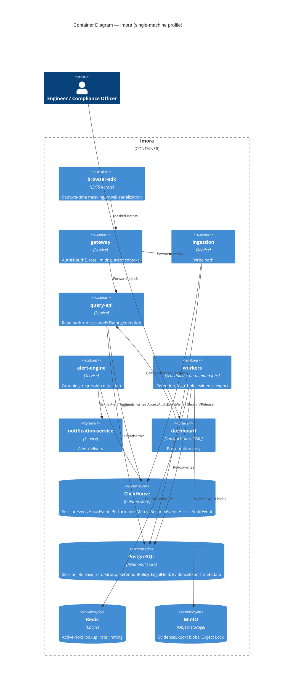
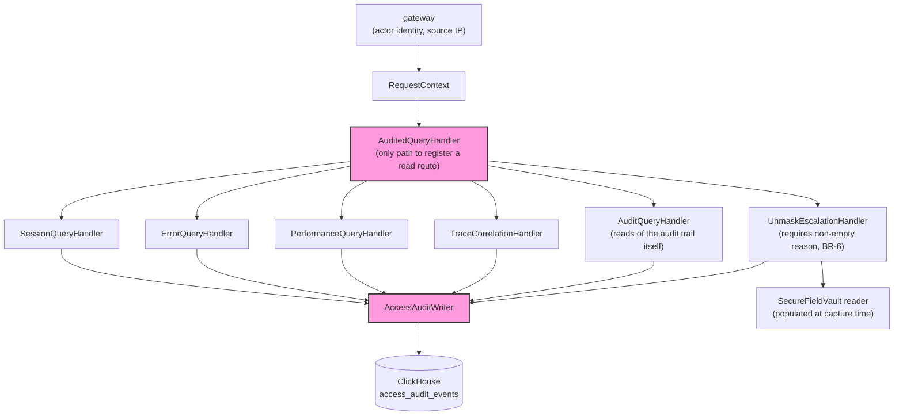
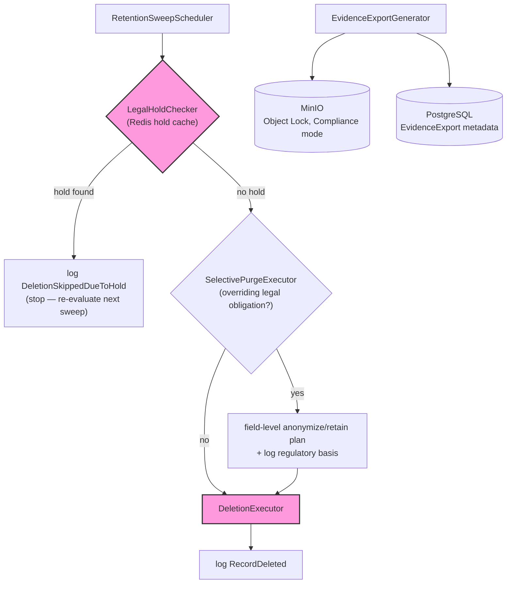
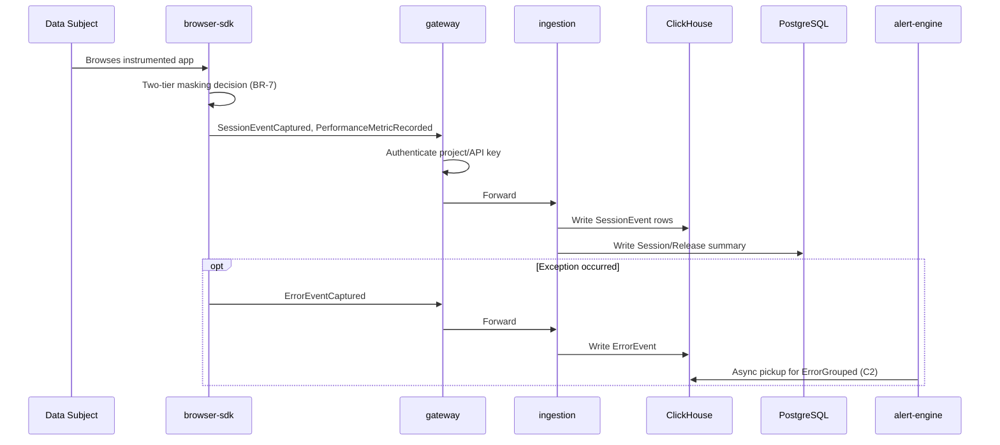
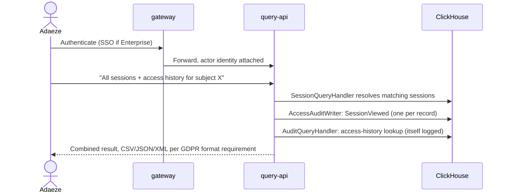
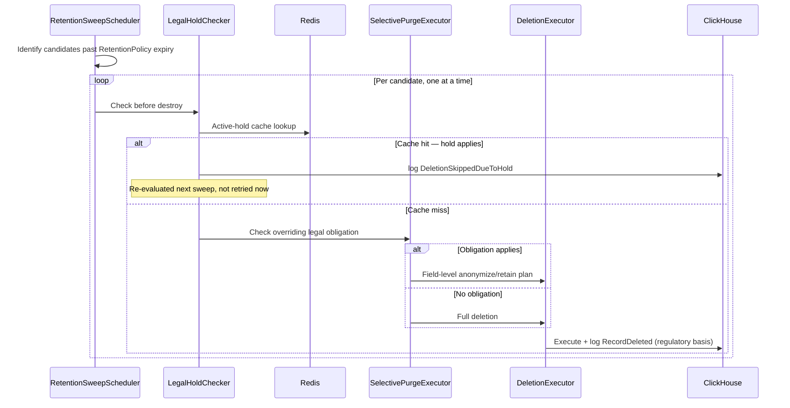
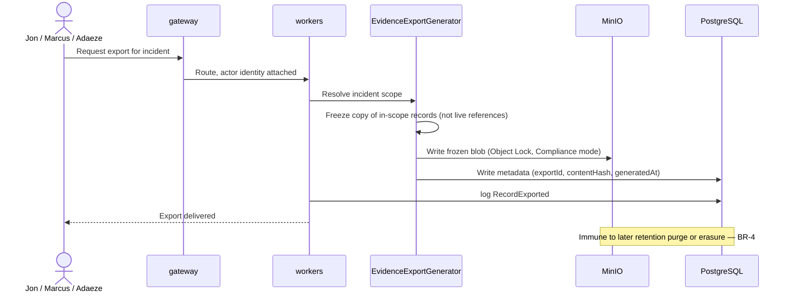

# Architecture Diagrams

## Container Diagrams

> Status: Research-based, current as of July 2026. C4 model Level 2 — expands the single "Imora" box from [System Context](README.md#system-context) into deployable containers: the eight bounded contexts from [Bounded Contexts](../02-domain/README.md#bounded-contexts), plus the data stores they depend on. Technology choices below aren't invented — they follow the storage split already implied by the `05-data/` scaffold (`README.md#clickhouse-schema`, `README.md#postgres-schema`) and real comparator architecture.

---

### Diagram — Single-Machine Profile

No message queue in this profile — `ingestion` writes directly to ClickHouse, per the single-machine simplification below.

---

### Data Stores

The write/read separation and column-store choice from [Bounded Contexts](../02-domain/README.md#bounded-contexts)'s modeling approach implies a specific storage split, matching the pattern of the closest architectural comparator (Uptrace, an open-source APM/observability platform whose entire self-hosted footprint is one binary plus ClickHouse, PostgreSQL, and Redis — deliberately no Kafka at small scale):

| Store | Holds | Why this store |
|---|---|---|
| **ClickHouse** | SessionEvent, ErrorEvent, PerformanceMetric, SecurityEvent, AccessAuditEvent | All five are high-volume, append-only, time-series-shaped — exactly the write pattern ClickHouse is built for, and the pattern [Bounded Contexts](../02-domain/README.md#bounded-contexts) already assumed for the write/read split. |
| **PostgreSQL** | Session (summary row), Release, ErrorGroup, RetentionPolicy, LegalHold, EvidenceExport (metadata + pointer), user/RBAC config | Small-cardinality, relational, transactionally updated data — a LegalHold being applied or lifted, or an ErrorGroup being assigned, needs ACID guarantees ClickHouse doesn't provide. |
| **Object Storage** (S3-compatible; MinIO for self-hosted deployments with no cloud dependency) | EvidenceExport frozen blob artifacts | Per [Business Rules](../02-domain/README.md#business-rules) BR-4, an EvidenceExport is a self-contained frozen copy — that copy is a blob, not a set of database rows, so it belongs in object storage with its `contentHash` recorded in Postgres. |
| **Redis** (small, optional even at scale) | Active-LegalHold lookup cache, gateway rate-limiting | [Business Rules](../02-domain/README.md#business-rules) BR-2 requires a hold check immediately before every deletion executes — running that as a full Postgres query per candidate record at scale is wasteful; a cache of currently-active holds, invalidated on LegalHoldApplied/LegalHoldLifted, keeps the check-before-destroy step fast without weakening it. |

---

### The Eight Containers

| Container | Technology shape | Responsibility (from [Bounded Contexts](../02-domain/README.md#bounded-contexts)) | Reads/Writes |
|---|---|---|---|
| **browser-sdk** | Client-side JS/TS library, not a server | Capture-time masking, rrweb-style event serialization | Sends to `gateway` |
| **gateway** | Stateless API/reverse-proxy service | AuthN/authZ, field-level access control, actor-context stamping | Reads Redis (rate limits), forwards to `ingestion`/`query-api` |
| **ingestion** | Stateless write-path service | Accepts and persists SessionEvent/ErrorEvent/PerformanceMetric/SecurityEvent/TraceLink | Writes ClickHouse; writes Session/Release rows to Postgres |
| **query-api** | Stateless read-path service | Serves replay/error/metric queries; **generates AccessAuditEvent on every VIEW/EXPORT/UNMASK** | Reads ClickHouse + Postgres + object storage; writes AccessAuditEvent to ClickHouse |
| **alert-engine** | Stream or scheduled batch processor | ErrorGroup grouping (write-time), Core Web Vitals regression detection | Reads/writes Postgres (ErrorGroup) and ClickHouse (metrics); emits AlertTriggered |
| **workers** | Scheduled/background job runner | RetentionPolicy sweeps (BR-1), legal-hold check-before-destroy (BR-2), selective purging (BR-3), EvidenceExport generation (BR-4) | Reads Redis (hold cache) + Postgres + ClickHouse; writes object storage (exports), AccessAuditEvent |
| **notification-service** | Stateless delivery service | Translates AlertTriggered into email/Slack/webhook delivery | Consumes from `alert-engine`; calls external channels (optional, per [System Context](README.md#system-context)) |
| **dashboard** | [TanStack Start](https://tanstack.com/start) — SSR, running on Node via its Nitro server build, not a static asset bundle | Presentation only — zero domain entities, zero audit-log authority, per [Bounded Contexts](../02-domain/README.md#bounded-contexts). **Server functions/loaders are a thin proxy to `query-api`'s REST API — never a direct store connection**, per that same document's ownership rule. | Calls `query-api` exclusively, from both server-rendered loaders and client-side navigation |

---

### `dashboard` Runs a Server Process Now — What That Does and Doesn't Change

`dashboard` was originally scoped as a static SPA (build-time-only, served as static assets). It's now [TanStack Start](https://tanstack.com/start), a full-stack React framework with server-side rendering and server functions, built on TanStack Router. Two consequences worth stating explicitly, since a framework capable of running server-side code is exactly the kind of change that could quietly erode a rule established elsewhere in this doc set:

- **What changes:** `dashboard` is no longer "no state, static asset serving" in [Deployment Model](README.md#deployment-model) and [Docker Compose](../12-infrastructure/README.md#docker-compose)'s resource tables — it's a running Node process (via Start's Nitro build target, which deploys to plain Node/Docker with no platform-specific dependency, consistent with [System Context](README.md#system-context)'s "no required external system" constraint the same way Next.js's Vercel-optimized feature set would not have been). Its container needs the same category of resource allocation as `gateway`/`query-api` — default limits, tunable — not the "static asset serving, no state" line item it had before.
- **What does not change:** the Conformist relationship from [Bounded Contexts](../02-domain/README.md#bounded-contexts) — `dashboard` still has zero domain entities and zero audit-log authority. TanStack Start's server functions (code that runs server-side, colocated with a route) make it *technically possible* for `dashboard` to hold its own Postgres/ClickHouse credentials and query a store directly, bypassing `query-api`'s `AuditedQueryHandler` entirely. **This must never happen.** Every server function and route loader in `dashboard` calls `query-api`'s REST API exactly as client-side code would — the only difference SSR introduces is *where* that HTTP call happens (server-side during the initial render, client-side on subsequent navigation), never *what* it's allowed to call. A server function that imports a database driver directly is a defect against this rule, not a legitimate optimization.

This is also the concrete reason TanStack Router (which Start is built on) is a good fit beyond team-ecosystem familiarity: its route loaders and search-param types are fully type-checked, which extends this document's "make the wrong thing not compile" thesis to the frontend's data-fetching layer, not just its own component props.

Sources: [TanStack Start Overview](https://tanstack.com/start/latest/docs/framework/react/overview), [Server Functions — TanStack Start docs](https://tanstack.com/start/latest/docs/framework/react/guide/server-functions), [TanStack Start vs Next.js 2026](https://www.alexcloudstar.com/blog/tanstack-start-vs-nextjs-2026/).

---

### Two Topology Profiles, Not One

Per [System Context](README.md#system-context)'s Operational Simplicity finding, and per Priya's story P1 (a 2–3 person team must be able to deploy a working single-machine instance), a full distributed topology — eight independently-scaled services plus ClickHouse, Postgres, object storage, and a message queue — is not a viable default. Uptrace and OpenObserve both resolve this the same way: **collapse the topology for small scale, expand it for large scale, without changing the domain model underneath.**

#### Single-Machine Profile (Milestone 1, story P1)

- All eight containers run as processes on one host (Docker Compose or equivalent), not eight separately-scaled deployments.
- **No message queue.** `ingestion` writes directly to ClickHouse; `alert-engine` and `workers` poll or subscribe directly rather than consuming from Kafka. This is the same simplification Uptrace makes at small scale — a queue exists to smooth backpressure and enable replay under load neither of which is a real constraint on a single machine.
- ClickHouse, Postgres, Redis, and object storage (MinIO) run as sibling containers on the same host.
- This profile must still pass every Milestone 1 exit criterion from [feature-roadmap.md](../08-roadmap/feature-roadmap.md) — audit-trail correctness and legal-hold enforcement are not weakened at small scale, only the deployment topology is simplified.

#### Cluster Profile (Milestone 3, large-enterprise scale)

- Containers scale independently; `ingestion` and `query-api` in particular, since they have different load shapes (write-heavy vs. read-latency-sensitive) per the write/read separation rationale.
- **A message queue (Kafka or equivalent) is introduced** between `ingestion` and its consumers (`alert-engine`, `workers`) specifically to buffer write bursts and allow reprocessing — the durability property a single-machine deployment doesn't need but a 300+-employee enterprise's transaction-volume does, per the org-size variants in [Target Users](../00-overview/README.md#target-users).
- ClickHouse and Postgres move to managed clusters (or multi-node self-managed) with the multi-region/HA orchestration tooling from [feature-roadmap.md](../08-roadmap/feature-roadmap.md) Milestone 3.

**The domain model, business rules, and event catalog from `02-domain/` do not change between profiles.** Only the physical deployment shape does — a query-api instance behaves identically whether it's one of one or one of twenty, per [Bounded Contexts](../02-domain/README.md#bounded-contexts)'s context boundaries.

---

### Data Flow, Narrated

- **Capture:** Data Subject browses → browser-sdk masks at capture time (BR-7) → gateway authenticates the ingesting client → ingestion writes SessionEvent/ErrorEvent/PerformanceMetric to ClickHouse, Session/Release rows to Postgres.
- **Investigation:** Engineer opens dashboard → query-api serves the replay/error/metric query from ClickHouse+Postgres → **query-api writes a SessionViewed AccessAuditEvent to ClickHouse as an inseparable part of that read**, per [Bounded Contexts](../02-domain/README.md#bounded-contexts)'s ownership rule.
- **Retention sweep:** workers evaluates RetentionPolicy on a schedule → checks Redis's active-hold cache (BR-2) → deletes (writes RecordDeleted) or skips (writes DeletionSkippedDueToHold) → both land in ClickHouse's AccessAuditEvent stream.
- **Evidence export:** Compliance Officer requests an export → workers freezes the referenced records into an object-storage blob (BR-4) → records the `contentHash` and metadata in Postgres → writes RecordExported to the audit log.

---

### Air-Gapped Constraint, Carried Forward

Per [System Context](README.md#system-context), none of the containers above may depend on an external system to perform a Parity or Wedge function. Concretely: ClickHouse, PostgreSQL, Redis, and object storage are all self-hosted components within the deployment boundary in both topology profiles — none of them are a cloud-managed dependency by default, which is what makes the air-gapped variant possible without a second, parallel architecture.

---

### What's Deliberately Not Modeled Here

- Internal structure of any single container (e.g., how `query-api` is organized internally) — that's `diagrams.md#component-diagrams`, next.
- Kubernetes manifests, actual node counts, or specific cloud/on-prem infrastructure choices — that's `README.md#deployment-model`.
- Concrete scaling thresholds (at what load does Milestone 1's single-machine profile stop being viable) — that's `README.md#scaling`.

---

Sources: [Self-hosting Uptrace](https://uptrace.dev/get/hosted), [What is observability in 2026? — ClickHouse](https://clickhouse.com/resources/engineering/what-is-observability), [ClickStack — ClickHouse](https://clickhouse.com/clickstack).

### What This Feeds Next

`research/03-architecture/diagrams.md#component-diagrams` should expand `query-api` and `workers` specifically — the two containers carrying the most business-rule weight (audit-event generation, BR-1 through BR-4) — into their internal component structure. `research/05-data/README.md#clickhouse-schema` and `README.md#postgres-schema` can now be written directly against the store assignments in this document.

---

## Component Diagrams

> Status: Research-based, current as of July 2026. C4 model Level 3 — internal structure, but only for the two containers from [Container Diagrams](diagrams.md#container-diagrams) that carry actual business-rule enforcement weight: `query-api` and `workers`. The other six containers (browser-sdk, gateway, ingestion, alert-engine, notification-service, dashboard) are comparatively thin at this altitude and get their internal detail in their own `04-services/*.md` doc instead of here.

---

### query-api — Internal Components

#### The structural problem this container has to solve

[Bounded Contexts](../02-domain/README.md#bounded-contexts) established that AccessAuditEvent generation must belong exclusively to `query-api`, never `dashboard` — but stating that as a rule doesn't make it true. A convention that engineers must "remember" to call the audit logger from every new query handler is exactly the failure mode [Business Rules](../02-domain/README.md#business-rules) BR-5 exists to prevent: a read that completes without an audit event is a defect, and defects happen precisely when correctness depends on someone remembering. The standard fix — and the one used in practice for exactly this problem (e.g., EF Core's interceptor pattern for automatic audit logging) — is to make the audit event **structurally inseparable from the read**, not procedurally attached to it.

#### Components

Every query handler is an `AuditedQueryHandler` instance — there is no code path that reaches ClickHouse without first passing through `AccessAuditWriter`, which is the diagram's way of showing what the prose below states as a rule: this is structural, not procedural.

- **RequestContext** — receives the authenticated actor identity and source IP/device from `gateway` (per [System Context](README.md#system-context)'s actor model) and attaches it to every downstream call. No component below this line can execute without one.
- **AuditedQueryHandler** — not a convention, a **framework-level wrapper type that is the only way to register a read route at all.** A future engineer adding a new query endpoint cannot skip the audit step because there is no code path to register a handler that isn't wrapped in this type — the same principle as a build that fails when a required wiring seam is absent, applied to routing instead of compilation. `SessionQueryHandler`, `ErrorQueryHandler`, `PerformanceQueryHandler`, `TraceCorrelationHandler`, and `AuditQueryHandler` are each instances of `AuditedQueryHandler`, not handlers that separately remember to call an audit function.
- **AuditQueryHandler** — serves reads *of* the audit trail itself ([REST API](../06-api/README.md#rest-api)'s `/v1/sessions/{id}/audit-trail`, and the access-history half of a DSAR query per [Sequence Diagrams](diagrams.md#sequence-diagrams) Flow B). Still wrapped in `AuditedQueryHandler` like every other read, but its own audit entry uses a lighter administrative action type rather than a recursive `SessionViewed` — querying the audit trail is a sensitive action worth recording, but must not regenerate its own infinite audit chain.
- **AccessAuditWriter** — the component `AuditedQueryHandler` invokes on every request, synchronously producing the SessionViewed/RecordExported AccessAuditEvent (per [Event Catalog](../02-domain/README.md#event-catalog)) before or atomically with returning data — a read that fails to log is a read that fails, not a read that silently skips logging.
- **UnmaskEscalationHandler** — validates BR-6's non-empty reason field before permitting an UNMASK action, then routes through `AuditedQueryHandler` like every other read — unmask is not a special, differently-audited path, it's the same mechanism with an extra required field.
- **SecureFieldVault reader** — resolves the masked-value lookup for an approved unmask request (see the two-tier masking clarification below). Read-only from `query-api`'s side; the vault itself is populated at capture time, not by query-api.

#### Two-Tier Masking — a Clarification This Document Has to Make Explicit

[Domain Model](../02-domain/README.md#domain-model) Invariant 4 says a field with no allow-list rule is masked before it's ever written to storage. Story M2 says a masked PHI field can be escalated to unmasked with a logged justification. Taken literally, these are in tension: if an unrecognized field's real value is never captured at all, there's nothing left to unmask later. The resolution is that "masking" is actually two different mechanisms, not one:

1. **Hard redaction** — a field matching no known rule at all (the "new form field shipped without a matching selector" failure mode from [Problem Statement](../00-overview/README.md#problem-statement)). The real value is never captured, never stored, anywhere, encrypted or not. This is irreversible by design — there is nothing to unmask.
2. **Soft masking with escalation** — a field matching a *known* PHI/PII pattern (name, MRN, diagnosis code, DOB — the examples from story M2). The real value **is** captured, but into the SecureFieldVault, encrypted at rest and access-gated, separate from the general SessionEvent payload. The default rendered view shows the masked placeholder; `UnmaskEscalationHandler` is the only path to the real value, and every use of that path is audited.

Only category 2 is unmaskable. This distinction belongs in this document specifically because it's a `query-api`/`browser-sdk` boundary decision — browser-sdk decides which category a field falls into at capture time, and `query-api` is where that decision's consequence (unmaskable or not) becomes visible.

---

### workers — Internal Components

#### Components

`DeletionExecutor` has no incoming path that bypasses `LegalHoldChecker` — the diagram is the enforcement of [Business Rules](../02-domain/README.md#business-rules)'s Conflict Precedence Summary, not just an illustration of it.

- **RetentionSweepScheduler** — triggers periodic RetentionPolicyEvaluated runs per data category, per BR-1.
- **LegalHoldChecker** — the check-before-destroy component implementing BR-2 exactly: queries the Redis active-hold cache (from [Container Diagrams](diagrams.md#container-diagrams)) immediately before any deletion, not at scheduling time. `DeletionExecutor` below is structurally incapable of running without first receiving a clear result from this component — the same "make the correct order the only possible order" principle applied to `query-api`'s audit wrapper above, applied here to [Business Rules](../02-domain/README.md#business-rules)'s Conflict Precedence Summary (hold check first, always).
- **SelectivePurgeExecutor** — implements BR-3's resolution for GDPR-erasure-vs-legal-obligation conflicts: given an erasure request and a set of overriding obligations, produces the specific field-level anonymize/retain plan and the regulatory basis to log, rather than a binary delete-everything/delete-nothing decision.
- **EvidenceExportGenerator** — implements BR-4: freezes the referenced Session/ErrorEvent/SecurityEvent/AccessAuditEvent records into a single object-storage blob, computes `contentHash`, and writes the Postgres metadata row — the component that makes an EvidenceExport genuinely immune to later retention or erasure actions, per [Domain Model](../02-domain/README.md#domain-model)'s resolved open question.
- **DeletionExecutor** — the only component permitted to issue an actual delete against ClickHouse or Postgres, and only ever invoked downstream of a clear `LegalHoldChecker` result.

#### Interaction Order (the sequence BR-2/BR-3's precedence rule requires)

`RetentionSweepScheduler` → `LegalHoldChecker` (hold? → log DeletionSkippedDueToHold, stop) → `SelectivePurgeExecutor` (overriding legal obligation? → field-level plan, log basis) → `DeletionExecutor` (only reachable if both prior checks clear). This ordering is not incidental — it's [Business Rules](../02-domain/README.md#business-rules)'s Conflict Precedence Summary made structural: a `workers` implementation where `DeletionExecutor` could be reached without passing through `LegalHoldChecker` first would reintroduce the exact race condition BR-2 exists to prevent.

---

### What's Deliberately Not Modeled Here

- Internal structure of `browser-sdk`, `gateway`, `ingestion`, `alert-engine`, `notification-service`, `dashboard` — each gets this level of detail in its own `research/04-services/*.md` if warranted, not here.
- Actual code/class names, language choice, or framework selection — that's an implementation decision downstream of this document, not a C4-level concern.
- The SecureFieldVault's encryption scheme — that's `07-security/README.md#encryption`.

---

Sources: [Comprehensive Guide to Implementing Audit Logging in .NET with EF Core Interceptors](https://dev.to/hootanht/comprehensive-guide-to-implementing-audit-logging-in-net-with-ef-core-interceptors-1e83).

### What This Feeds Next

`research/03-architecture/diagrams.md#sequence-diagrams` should trace at least two flows through these components step-by-step: a DSAR query (story A1, through `query-api`'s AuditedQueryHandler) and a retention sweep hitting an active hold (through `workers`' interaction order above). `research/07-security/README.md#pii-redaction` should specify the SecureFieldVault mechanism the two-tier masking clarification depends on.

---

## Sequence Diagrams

> Status: Traces four flows step-by-step through the components defined in [Container Diagrams](diagrams.md#container-diagrams) and [Component Diagrams](diagrams.md#component-diagrams), applying the business rules from [Business Rules](../02-domain/README.md#business-rules) concretely rather than restating them abstractly. Each flow is rendered as a Mermaid sequence diagram, with the numbered prose immediately below it as the citation-bearing detail the diagram can't carry — read the diagram for shape, the prose for why.

---

### Flow A — Session Capture (Parity)

The foundational flow; every other sequence below depends on data having entered the system this way.

1. Data Subject browses the organization's instrumented web application.
2. `browser-sdk` observes DOM state via the rrweb-style capture pattern (full snapshot + incremental mutations, per [Domain Model](../02-domain/README.md#domain-model)).
3. For each field, `browser-sdk` applies the two-tier masking decision from [Component Diagrams](diagrams.md#component-diagrams): known-safe fields captured as-is; known-PHI/PII fields captured into the SecureFieldVault with a masked placeholder in the event payload; unrecognized fields hard-redacted (BR-7) — never captured at all.
4. `browser-sdk` emits `SessionEventCaptured` and `PerformanceMetricRecorded` events to `gateway`.
5. `gateway` authenticates the ingesting client (project/API key) and forwards to `ingestion`.
6. `ingestion` writes SessionEvent rows to ClickHouse, a Session summary row to Postgres, tagged with the active Release.
7. If an exception occurred: `ErrorEventCaptured` follows the same path; `alert-engine` picks it up asynchronously for `ErrorGrouped` write-time grouping (story C2).

---

### Flow B — DSAR Query (Wedge, Story A1)

Adaeze's one-month clock from [User Personas](../01-product/README.md#user-personas) starts the moment this flow needs to run.

1. Adaeze authenticates via `gateway` (SSO if Enterprise tier, per [System Context](README.md#system-context)).
2. `gateway` attaches actor identity (userId, source IP) to the request context, forwards to `query-api`.
3. Adaeze issues a query — "all sessions and access history for data subject X" — via `dashboard`, which calls `query-api` directly with no translation of its own (per [Bounded Contexts](../02-domain/README.md#bounded-contexts)'s Conformist relationship).
4. `query-api`'s `SessionQueryHandler` (an `AuditedQueryHandler` instance, per [Component Diagrams](diagrams.md#component-diagrams)) resolves matching Sessions from ClickHouse/Postgres.
5. **Before or atomically with returning results**, `AccessAuditWriter` writes one `SessionViewed` AccessAuditEvent per session record touched — granular enough to answer "who viewed *this specific* session," not an aggregate "DSAR query ran" log line.
6. `query-api` separately queries AccessAuditEvent history for those sessions via `AuditQueryHandler` to answer "who has looked at this." **This read is itself logged**, using a lighter administrative action type rather than a recursive `SessionViewed` entry — querying the audit trail is still a sensitive action worth recording, but doesn't need to regenerate its own infinite audit chain.
7. `query-api` returns the combined result (session records + access history) in a non-proprietary format (CSV/JSON/XML, per story A1's acceptance criteria) — Adaeze's answer, typically in minutes rather than the multi-hour manual log search this flow replaces.

---

### Flow C — Retention Sweep Hitting an Active Legal Hold (Wedge, BR-1/BR-2)

1. `RetentionSweepScheduler` triggers on schedule for a given data category (its own clock, per BR-1).
2. The scheduler identifies candidate records past their RetentionPolicy expiry.
3. For each candidate — one at a time, not as a pre-checked batch — `LegalHoldChecker` queries the Redis active-hold cache, kept current by invalidation on every `LegalHoldApplied`/`LegalHoldLifted` event.
4. **Cache hit** (the record's scope matches an active hold): deletion is skipped; `workers` writes `DeletionSkippedDueToHold`; the record is re-evaluated on the next scheduled sweep, not retried immediately.
5. **Cache miss:** `SelectivePurgeExecutor` checks whether an overriding legal obligation applies independent of any explicit hold (BR-3's non-hold case — e.g., a HIPAA floor still active with no LegalHold entity involved). If yes, it computes a field-level anonymize/retain plan; if no, the record proceeds to full deletion.
6. `DeletionExecutor` executes — full or selective — and writes `RecordDeleted` with the specific regulatory basis that triggered it.
7. **The race condition BR-2 exists to prevent, resolved concretely:** because the hold check happens immediately before *each individual record's* deletion rather than once for the whole sweep batch, a hold applied mid-sweep is caught for every record not yet processed. Records already deleted earlier in the same sweep, before the hold existed, were deleted legitimately under policy — the hold's absence at that moment is the correct historical fact, not a bug to reconcile after the fact.

---

### Flow D — Evidence Export Generation (Wedge, Story J2/BR-4)

1. Jon, Marcus, or Adaeze requests an evidence export for a specific incident, via `dashboard` → `gateway`.
2. `gateway` attaches actor identity, routes to `workers` (export generation is a `workers` responsibility, not `query-api`'s, per [Container Diagrams](diagrams.md#container-diagrams)).
3. `EvidenceExportGenerator` resolves the incident's scope — which Sessions, ErrorEvents, SecurityEvents, and AccessAuditEvents are in-play.
4. `EvidenceExportGenerator` freezes a copy of every in-scope record into a single object-storage blob (MinIO) — a copy, not a set of live references, per [Domain Model](../02-domain/README.md#domain-model)'s resolved open question.
5. `EvidenceExportGenerator` computes `contentHash` over the frozen blob and writes the EvidenceExport metadata row (exportId, incidentReference, contentHash, generatedAt) to Postgres.
6. `workers` writes `RecordExported` to the audit log.
7. The requesting actor receives the export. Per BR-4, this artifact remains valid regardless of what happens to the source data afterward — a later retention sweep (Flow C) or erasure request cannot touch it, because it was never a live reference to begin with.

---

### What These Four Flows Establish Together

Flow A is the only one that doesn't touch AccessAuditEvent — everything downstream of ingestion (B, C, D) produces one, which is the concrete, traceable version of [Bounded Contexts](../02-domain/README.md#bounded-contexts)'s claim that the wedge isn't a bolt-on: from the moment data exists in the system, every subsequent read, deletion, skip, or export is accounted for by construction, not by a policy document describing what's supposed to happen.

### What This Feeds Next

`research/03-architecture/README.md#deployment-model` should specify where each component in these flows actually runs (single-machine vs. cluster profile, per [Container Diagrams](diagrams.md#container-diagrams)). `research/06-api/README.md#rest-api` and `research/06-api/README.md#sdk-api` can be written directly against Flow A and Flow B's request/response shapes.

