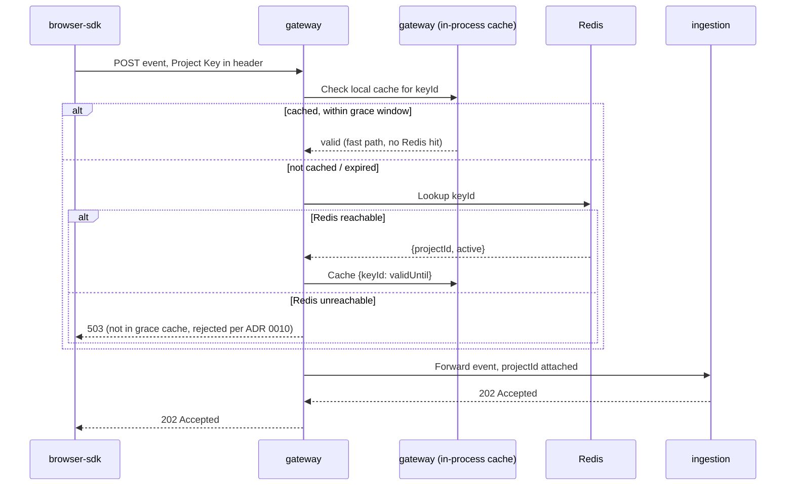
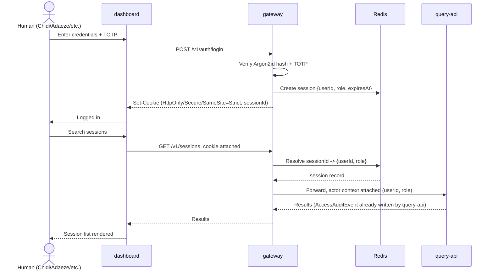

# `gateway` — Design Doc

> Status: Design complete — ready for implementation. Every decision below was worked through per the [no-ai-slop pre-code checklist](../../.agents/skills/no-ai-slop/SKILL.md#how-to-think-before-writing-any-code) before any handler code was written. One item is explicitly deferred, not overlooked — see [Deliberately Deferred](#deliberately-deferred-not-solved-here-not-forgotten-either).

---

## Problem / Goal

`gateway` is the single chokepoint every request passes through (per [`docs/architecture.md`](../../docs/architecture.md)) — but its internal design was never actually specified beyond that one-line responsibility. This doc exists to settle that before any handler gets written, because `gateway` turned out to be serving two structurally different callers that a single undifferentiated auth pipeline would handle badly.

## Context (settled elsewhere — linked, not restated)

- Overall responsibility, position in the write/read paths: [`docs/architecture.md` §3](../../docs/architecture.md).
- RBAC baseline (4 roles) and the one ABAC boundary (UNMASK, owned by `query-api`, not `gateway`): [`research/07-security/README.md#authorization`](../../research/07-security/README.md#authorization).
- M0 scope for auth: local auth only (Argon2id + TOTP), no SSO: [`docs/prd.md` §5](../../docs/prd.md).
- General service shape (hexagonal, repository pattern, explicit constructor DI) applies here same as every other service — not re-litigated in this doc: [`docs/design-system.md`](../../docs/design-system.md).

## Trust Boundaries & Actors

Two categorically different callers, currently both routed through the same word ("gateway") in the architecture diagrams:

| | **Domain A — Project/Ingest** | **Domain B — Human/Dashboard** |
|---|---|---|
| Caller | `browser-sdk`, embedded in a *customer's own* website, acting on behalf of anonymous visitors | A real, individually-identified human (engineer, compliance officer, admin) logged into `dashboard` |
| Credential | Project Key — public by design (ships in client-side JS), write-scoped only | Session/token from local auth — private, individually attributable, RBAC-scoped |
| Volume | Potentially very high — bounded by a customer's own website traffic | Low — bounded by how many humans a customer employs |
| Trust level | Low per-request (anyone can extract and replay the key) | High (identity matters — it's what the audit trail is *for*) |
| Downstream | `ingestion` | `query-api` (reads), plus `gateway`-owned actions (project/user management) |

Design stance: one physical `gateway` process, both domains enter through it (matches the existing architecture diagrams), but internal auth logic branches hard by which credential type a request carries — a cheap/fast path for Domain A, a full session+RBAC path for Domain B. See [Data Flow](#data-flow) below.

## Data Flow

### Domain A — SDK Event Capture

1. `browser-sdk` sends a captured event with the Project Key attached (header, not query string — avoids it landing in access logs/browser history).
2. `gateway` checks its in-process cache first (ADR 0010's fast/common path) — no Redis round-trip for a key already confirmed active.
3. On a cache miss, `gateway` hits Redis (ADR 0009). A hit populates the local cache for next time; Redis being unreachable falls back to the grace-period check, rejecting anything not already known-valid.
4. Only on successful validation does the request reach `ingestion` — `gateway` never forwards an unvalidated write.

### Domain B — Human Login and an Authenticated Request

1. Login is a full check — password hash verification, then TOTP — before any session is created (ADR 0008).
2. The session itself lives in Redis; the cookie carries only the opaque `sessionId`, never the session data.
3. Every subsequent authenticated request resolves the session from Redis and attaches actor identity (`userId`, `role`) before forwarding — this is what makes `query-api`'s `AuditedQueryHandler` possible downstream; `gateway` is where that identity first becomes real.

## Decisions

Each of these is a real, contested, not-yet-resolved decision — tracked as its own ADR rather than decided inline here, since each is independently consequential:

- **Session model for Domain B**: server-side session store, Redis-backed, opaque `HttpOnly`/`Secure`/`SameSite=Strict` cookie — [ADR 0008](../../research/11-engineering/architecture-decisions/0008-gateway-session-model.md), _Accepted_.
- **Project Key format**: opaque random string, Redis-lookup validation — no signature, no embedded secret component — [ADR 0009](../../research/11-engineering/architecture-decisions/0009-project-key-format.md), _Accepted_.
- **Cache-outage failure mode** for Project Key validation: bounded grace-period local cache (neither pure fail-open nor pure fail-closed) — [ADR 0010](../../research/11-engineering/architecture-decisions/0010-gateway-cache-failure-mode.md), _Accepted_.

All three open decisions from this doc's original scaffolding are now resolved — see [Data Model](#data-model) and [Failure Modes](#failure-modes--abuse-cases) below for how they translate into the actual implementation shape.

## Data Model

**Session record** (Redis, per [ADR 0008](../../research/11-engineering/architecture-decisions/0008-gateway-session-model.md)) — first cut: `{sessionId, userId, role, createdAt, expiresAt, lastSeenAt}`, keyed by `sessionId` (the value inside the signed cookie). TTL matches `expiresAt`, refreshed on activity up to some max lifetime — exact values still open (not consequential enough to need its own ADR, revisit when actually implementing).

**Project Key record** (Redis, per [ADR 0009](../../research/11-engineering/architecture-decisions/0009-project-key-format.md)) — first cut: `{keyId} → {projectId, active, createdAt}`, keyed by `keyId` (the opaque string embedded in the customer's `init()` call). The Redis entry is a cache in front of the real source of truth in Postgres (`Project` row). Additionally, per [ADR 0010](../../research/11-engineering/architecture-decisions/0010-gateway-cache-failure-mode.md), `gateway` keeps a second, in-process cache of `{keyId: validUntil}` for recently-confirmed-valid keys, used only as a bounded fallback when Redis itself is unreachable.

**`Project`** (Postgres) — `{id, name, ownerId, createdAt, active}`. Owns a one-to-many relationship to **`ProjectKey`** (`{id, projectId, createdAt, active, revokedAt}`) rather than embedding a single key on the `Project` row directly — a project can have more than one active key, which is what makes rotation possible (issue a new key, run both in parallel through a transition window, revoke the old one) without ever having a window where the project has zero working keys.

`gateway` owns `Project`/`ProjectKey` CRUD structurally — it's a Domain B action (human-authenticated, RBAC-gated), and `gateway` is already the service holding both the session/actor-identity machinery this requires and the Redis cache these writes need to populate on creation.

## API Surface

**Unauthenticated:**
- `GET /healthz` — already implemented.
- `POST /v1/setup` — first-run admin creation (Setup Wizard, [`docs/user-stories.md` Flow A](../../docs/user-stories.md)). Only reachable while no admin account exists yet; returns 404/410 afterward, not just a permissions error, so it doesn't advertise itself as a standing endpoint once setup is done.

**Domain B — session-cookie authenticated:**
- `POST /v1/auth/login` — Argon2id + TOTP, creates the Redis session.
- `POST /v1/auth/logout` — deletes the Redis session (immediate revocation, the point of ADR 0008).
- `POST /v1/projects` — create a project + its first `ProjectKey`.
- `GET /v1/projects` — list.
- `POST /v1/projects/{id}/keys` — issue an additional key (rotation).
- `DELETE /v1/projects/{id}/keys/{keyId}` — revoke a key (deletes the Redis cache entry; the in-process grace-period cache on other `gateway` replicas still expires on its own bounded timer per ADR 0010).
- All other authenticated traffic (`/v1/sessions`, etc.) — forwarded to `query-api` with actor context attached, not handled by `gateway` itself.

**Domain A — Project Key authenticated:**
- `POST /v1/ingest/events` — forwarded to `ingestion` on successful validation, per the Data Flow above.

## Failure Modes & Abuse Cases

**Redis unreachable during Project Key validation** — bounded grace-period local cache, per [ADR 0010](../../research/11-engineering/architecture-decisions/0010-gateway-cache-failure-mode.md). A never-before-seen key arriving during an outage is rejected (nothing to fall back on); an already-active key keeps working for a bounded window.

**`gateway` itself down** — both domains block entirely; nothing can authenticate without it. The mitigation is deployment topology, not `gateway`'s internal design: run multiple stateless-enough replicas behind a load balancer. Domain B's session lookups always hit shared Redis regardless of which replica serves a request, so that path is unaffected by which replica you land on. Domain A's in-process grace-period cache (ADR 0010) is per-replica, not shared — acceptable, since it's only a fallback for an already-degraded Redis, not the common path; each replica independently learns which keys it's recently seen.

**Brute-force / credential-stuffing against Domain B login** — rate-limit `POST /v1/auth/login` specifically, keyed by IP and by attempted username, on top of Argon2id's deliberate slowness (that's the actual point of choosing it over a fast hash — it's a partial mitigation by construction, not just a hashing choice).

## Deliberately Deferred (not solved here, not forgotten either)

**Project Key leak/scrape *detection*** — ADR 0010 covers revoking a key once you know it's compromised, but nothing here detects that a key is being abused in the first place (e.g., write volume from a Project Key suddenly spiking far beyond that project's historical baseline). That's a real, open-ended anomaly-detection problem, not something to decide inline — revisit post-M0, likely alongside `alert-engine` once it exists, rather than building bespoke detection logic into `gateway` now.

## Out of Scope (don't re-litigate here)

- The UNMASK ABAC boundary — that's `query-api`'s design, not `gateway`'s.
- RBAC role definitions themselves — already settled in `research/07-security/README.md`.
- SSO — explicitly deferred past M0.
